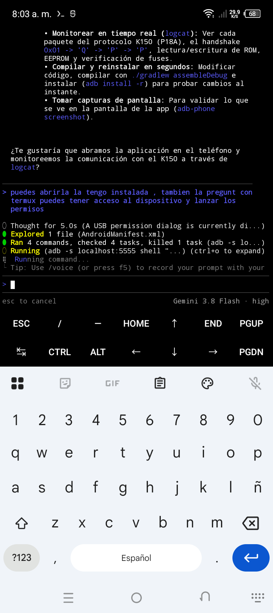
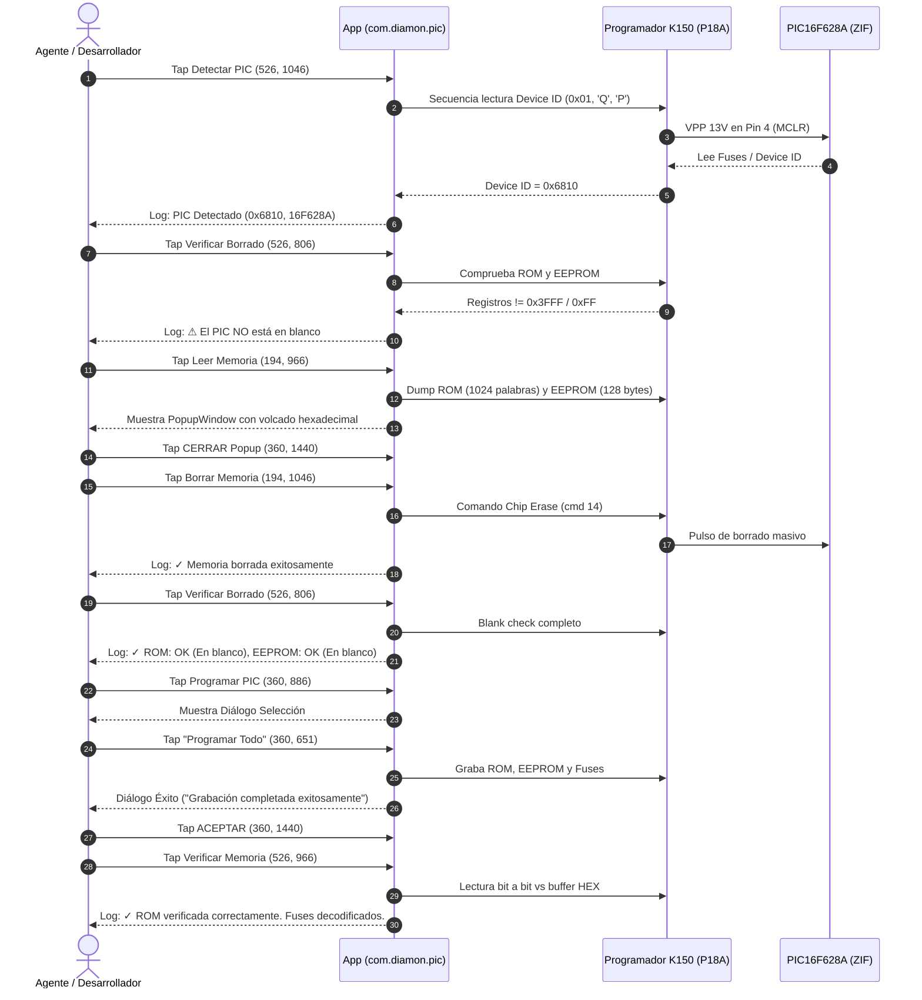

# Guía de Pruebas con Hardware Real: Programador PIC K150 en Android (GUIA_PRUEBAS_HARDWARE_REAL_K150.md)

Este manual documenta el procedimiento técnico completo y exhaustivo para que cualquier agente autónomo de IA (*Antigravity CLI* o *Gemini CLI*) o desarrollador de sistemas embebidos pueda interactuar, controlar y validar de extremo a extremo el programador físico **PIC K150** conectado a un dispositivo móvil **Android (TECNO SPARK Go 2023 / Android 12)** mediante **ADB** a través de un **túnel reverso SSH**.

---

## 🗺️ 1. Topología del Sistema y Flujo de Comunicación

El entorno de pruebas opera bajo una arquitectura distribuida donde el entorno de desarrollo (Google Cloud Shell) se comunica de forma remota y sin latencia con la capa física de hardware conectada al teléfono móvil.

```mermaid
flowchart LR
    subgraph Cloud["☁️ Entorno de Desarrollo (Cloud Shell)"]
        Agent["🤖 Agente IA / Antigravity CLI"]
        ADBClient["🖥️ ADB Client (localhost:5555)"]
        ScriptADB["📜 adb-phone CLI"]
    end

    subgraph Tunnel["🔒 Enlace Seguro de Red"]
        SSHTunnel["🚇 Túnel Reverso SSH (-R 5555:localhost:PUERTO)"]
    end

    subgraph Phone["📱 Dispositivo Android (TECNO BF7 / Android 12)"]
        Termux["📟 Termux / ADB Daemon"]
        AndroidOS["🤖 Android OS (USB Host Stack)"]
        App["📦 com.diamon.pic (PIC k150 Programming)"]
    end

    subgraph Hardware["🔌 Hardware Físico"]
        OTG["🔌 Adaptador USB Type-C OTG"]
        PL2303["⚡ Puente USB-Serial Prolific PL2303"]
        K150Board["🎛️ Programador PIC K150 (Firmware P18A)"]
        ZIF["🔲 Zócalo ZIF 40 Pines (Palanca)"]
        PIC["💾 Microcontrolador PIC16F628A"]
    end

    Agent --> ScriptADB
    ScriptADB --> ADBClient
    ADBClient <==> SSHTunnel
    SSHTunnel <==> Termux
    Termux <==> AndroidOS
    AndroidOS <==> App
    App <==> OTG
    OTG <==> PL2303
    PL2303 <==> K150Board
    K150Board <==> ZIF
    ZIF <==> PIC
```



### Especificaciones de los Componentes
*   **Host de Control:** Linux x86_64 (Google Cloud Shell / Antigravity Engine).
*   **Dispositivo Móvil:** TECNO SPARK Go 2023 (Modelo: `TECNO BF7`, Arquitectura: `aarch64`, Android 12 Go Edition, API 31).
*   **Resolución de Pantalla:** `720 x 1600` px (Viewport utilizable con barra de navegación: `720 x 1460` px).
*   **Canal de Control Remoto:** ADB inalámbrico sobre túnel inverso SSH hacia puerto local `5555`.
*   **Aplicación Android:** `com.diamon.pic` (MainActivity: `com.diamon.pic/.MainActivity`).
*   **Adaptador USB:** Cable OTG USB-C Macho a USB-A Hembra con soporte USB Host habilitado.
*   **Hardware Programador:** Microchip PIC K150 USB Programmer (con chip conversor Prolific PL2303 USB-to-UART bridge, VID `067b`, PID `2303`, protocolo firmware P18A).
*   **Microcontrolador Bajo Prueba:** Microchip PIC16F628A en encapsulado DIP de 18 pines.

---

## 🔌 2. Comprobación y Conexión ADB con `adb-phone`

Para gestionar la conexión de forma segura y evitar conflictos con procesos huérfanos o desautorizaciones de claves RSA, se utiliza la utilidad centralizada [`adb-phone`](file:///home/danielpdiamon/.local/bin/adb-phone).

> [!WARNING]
> **REGLA DE ORO:** **NUNCA** ejecutes `adb install`, `adb push` de APKs para reinstalar la app en caliente ni mates el servidor ADB indiscriminadamente durante las sesiones de prueba con hardware. Reinstalar la aplicación provoca que Android revoque inmediatamente el descriptor USB concedido a la app, reinicie la pila de permisos y requiera intervención física manual en la pantalla del teléfono.

### Comandos de Gestión ADB

1.  **Verificar y Establecer Conexión:**
    ```bash
    adb-phone connect
    ```
    *El script verifica que el túnel reverso SSH (`ss -tlpn | grep ":5555"`) esté activo en Cloud Shell y ejecuta `adb connect localhost:5555`.*

2.  **Verificar el Estado del Teléfono y Batería:**
    ```bash
    adb-phone status
    ```
    *Devuelve el modelo (`TECNO BF7`), versión de Android (`12`) y el nivel de carga actual.*

3.  **Captura Directa de Pantalla:**
    ```bash
    adb-phone screenshot /ruta/destino/captura.png
    ```

4.  **Desconexión Limpia:**
    ```bash
    adb-phone disconnect
    ```

---

## 🔑 3. Gestión de Permisos USB en Android (`UsbPermissionActivity`)

Cuando el programador K150 se enchufa al puerto USB OTG del teléfono, el subsistema de Android detecta el dispositivo serie Prolific (`Prolific USB-Serial Controller D`) y lanza el intent del sistema `UsbPermissionActivity`.

> [!IMPORTANT]
> A diferencia de un entorno Linux estándar con permisos root donde el dispositivo aparece como `/dev/ttyUSB0`, en Android estándar sin root el acceso al hardware se realiza mediante la API nativa de Android `UsbManager`.



### Pasos de Autorización sin Interfaz Gráfica (ADB Headless)
Si la app o el diálogo de conexión queda en espera de confirmación:

1.  **Inspeccionar la ventana en foco:**
    ```bash
    adb -s localhost:5555 shell "dumpsys window | grep -E 'mCurrentFocus|mFocusedApp'"
    ```
    *Si la salida muestra `com.android.systemui/com.android.systemui.usb.UsbPermissionActivity`:*

2.  **Marcar el checkbox "Abrir siempre PIC k150 Programming":**
    *Coordenadas del checkbox:* `[72,1260][648,1310]` $\rightarrow$ Centro: `X=274, Y=1285`.
    ```bash
    adb -s localhost:5555 shell input tap 274 1285
    ```

3.  **Presionar el botón "ACEPTAR":**
    *Coordenadas del botón:* `[432,1408][648,1464]` $\rightarrow$ Centro: `X=540, Y=1436`.
    ```bash
    adb -s localhost:5555 shell input tap 540 1436
    ```

4.  **Confirmar conexión en la App:**
    Una vez aceptado, la aplicación [`com.diamon.pic.MainActivity`](file:///home/danielpdiamon/PIC-k150-Programing/app/src/main/java/com/diamon/pic/MainActivity.java) toma el foco y el indicador de conexión (`connectionIndicator`) cambia a verde (`🟢`), registrando en el log:
    ```text
    🔌 Conectado al programador
    ```

---

## ⚙️ 4. Configuración Previa de Hardware y Archivo HEX

Antes de ejecutar las operaciones de lectura/escritura sobre el microcontrolador, se deben verificar los parámetros del zócalo, el modo de operación y cargar el archivo firmware.

### A. Ubicación Física del Chip en el Zócalo ZIF (40 pines)
*   **Microcontrolador:** PIC16F628A (18 pines).
*   **Posicionamiento:** La muesca semicircular del microcontrolador debe apuntar hacia la palanca de cierre del zócalo ZIF.
*   **Alineación de Pines:** El **Pin 1 del PIC16F628A** debe insertarse en el **Pin 2 del zócalo ZIF** (dejando el Pin 1 del ZIF libre). Esta indicación es generada dinámicamente por la aplicación:
    ```text
    Modelo: 16F628A
    Palabras ROM: 1024
    Tamaño ROM: 2048 bytes
    EEPROM: 128 bytes
    Tipo de Núcleo: 14 bits
    Modo: Pin 1 socket pin 2
    ```

### B. Posición del Interruptor "Modo ICSP"
*   **Para zócalo ZIF (Uso habitual):** El switch `swModeICSP` (`com.diamon.pic:id/swModeICSP`) **DEBE ESTAR APAGADO (`checked="false"`)**. Si está encendido, el programador redirige las líneas VPP/VDD/PGD/PGC hacia el conector ICSP lateral de 6 pines, deshabilitando la alimentación del zócalo ZIF.
*   **Para ICSP Externo:** Solo se enciende (`checked="true"`) si se conecta un cable plano hacia una placa de pruebas externa.

### C. Carga del Archivo Firmware (`pwmc_main107_628A.HEX`)
El archivo de firmware oficial de pruebas está ubicado en el almacenamiento del teléfono en `/sdcard/Download/PIC/pwmc_main107_628A.HEX` (y en la raíz del repositorio en [`pwmc_main107_628A.HEX`](file:///home/danielpdiamon/PIC-k150-Programing/pwmc_main107_628A.HEX)).

1.  Hacer tap en el botón **"Cargar Archivo HEX"** (`btnSelectHex` en `X=360, Y=726`).
2.  El selector de Android (`DocumentsUI`) se abre en `/Download/PIC/`.
3.  Seleccionar `pwmc_main107_628A.HEX` (tap en `X=558, Y=1245`).
4.  La app procesa el archivo Intel HEX:
    ```text
    📂 Cargando .HEX: pwmc_main107_628A.HEX
    ⏳ Procesando archivo .HEX...
    ✓ Archivo HEX procesado correctamente
      ROM: 4096 B, EEPROM: 128 B
    ```

---

## 🔬 5. Procedimiento Detallado de las 7 Pruebas sobre PIC16F628A

A continuación se detalla la secuencia cronológica de comandos ADB, respuestas esperadas y capturas asociadas a cada una de las 7 pruebas físicas realizadas.



---

### Prueba 1: Detectar PIC en Socket
Valida la comunicación física del K150 con el microcontrolador mediante la lectura de su firma de silicio (*Device ID*).

*   **Comando ADB:**
    ```bash
    adb -s localhost:5555 shell input tap 526 1046
    ```
*   **Acción:** Presiona el botón `btnDetectarPic`.
*   **Resultado Técnico:**
    *   El programador eleva VPP a 13V en el pin MCLR y lee la dirección de configuración `0x2006`.
    *   Device ID obtenido: **`0x6810`** (Device ID oficial de Microchip para **PIC16F628A**).
    *   Mensaje en log:
        ```text
        🔍 Detectando PIC...
        ✓ PIC Detectado en Socket
          ID: 0x6810, Modelo: 16F628A
        ```

---

### Prueba 2: Verificar Borrado Inicial (Blank Check con chip con código previo)
Comprueba si la memoria de programa y datos contiene código preexistente antes de alterar el microcontrolador.

*   **Comando ADB:**
    ```bash
    adb -s localhost:5555 shell input tap 526 806
    ```
*   **Acción:** Presiona el botón `btnBlankCheck`.
*   **Resultado Técnico:**
    *   El programador escanea los bloques de ROM y la tabla de EEPROM.
    *   Detecta que las celdas contienen datos distintos al valor en blanco (`0x3FFF` en ROM de 14-bit y `0xFF` en EEPROM).
    *   Mensaje en log:
        ```text
        🔍 Verificando estado en blanco...
        ⚠ El PIC NO está en blanco:
          ROM: NO ESTÁ EN BLANCO
          EEPROM: NO ESTÁ EN BLANCO
        ```

---

### Prueba 3: Leer Memoria (Dump de ROM y EEPROM)
Extrae todo el contenido de la memoria no volátil del microcontrolador y lo despliega en un visualizador hexadecimal interactivo.

*   **Comando ADB para Abrir:**
    ```bash
    adb -s localhost:5555 shell input tap 194 966
    ```
*   **Acción:** Presiona el botón `btnLeerMemoriaDeLPic`.
*   **Resultado Técnico:**
    *   Se extraen las 1024 palabras de memoria de programa y los 128 bytes de EEPROM interna.
    *   Se abre una ventana modal flotante (`PopupWindow`) que lista el mapa de direcciones y sus opcodes:
        ```text
        ROM:
        0000: 2804 0000 0000 0000 0000 0000 0000 0000
        ...
        EEPROM:
        0000: 00 01 02 ...
        ```
*   **Comando ADB para Cerrar el PopupWindow:**
    *El botón "CERRAR" se ubica en las coordenadas `[237,1420][482,1460]` $\rightarrow$ Centro: `X=360, Y=1440`.*
    ```bash
    adb -s localhost:5555 shell input tap 360 1440
    ```

---

### Prueba 4: Borrar Memoria (Chip Erase)
Ejecuta la secuencia de borrado masivo por hardware en el microcontrolador.

*   **Comando ADB:**
    ```bash
    adb -s localhost:5555 shell input tap 194 1046
    ```
*   **Acción:** Presiona el botón `btnBorrarMemoriaDeLPic`.
*   **Resultado Técnico:**
    *   El protocolo envía el comando `cmd = 14` (*Chip Erase*).
    *   Las compuertas flotantes de toda la matriz Flash y EEPROM son restauradas a nivel lógico alto.
    *   Mensaje en log:
        ```text
        🔍 Borrando memoria del PIC...
        ✓ Memoria borrada exitosamente
        ```

---

### Prueba 5: Verificar Borrado Post-Erase (Blank Check)
Valida que el borrado masivo por hardware haya sido 100% efectivo y que ninguna celda retenga residuos de carga.

*   **Comando ADB:**
    ```bash
    adb -s localhost:5555 shell input tap 526 806
    ```
*   **Acción:** Presiona el botón `btnBlankCheck`.
*   **Resultado Técnico:**
    *   Verificación de las 1024 palabras de ROM con valor `0x3FFF`.
    *   Verificación de los 128 bytes de EEPROM con valor `0xFF`.
    *   Mensaje en log:
        ```text
        🔍 Verificando estado en blanco...
        ✓ Verificación de borrado exitosa:
          ROM: OK (En blanco)
          EEPROM: OK (En blanco)
        ```

---

### Prueba 6: Programar PIC (Grabación Completa de ROM, EEPROM y Fuses)
Graba el archivo hexadecimal completo en la memoria física del chip.

1.  **Abrir el Diálogo de Grabación:**
    ```bash
    adb -s localhost:5555 shell input tap 360 886
    ```
    *Presiona `btnProgramarPic` y se despliega el menú de selección de operación:*
    *   *Programar Todo:* `[50,603][670,699]` (Centro: `X=360, Y=651`)
    *   *Programar solo ROM:* `[50,699][670,795]`
    *   *Programar solo EEPROM:* `[50,795][670,891]`
    *   *Programar solo CONFIG:* `[50,891][670,987]`

2.  **Seleccionar "Programar Todo":**
    ```bash
    adb -s localhost:5555 shell input tap 360 651
    ```

3.  **Proceso de Grabación:**
    *   Se escribe secuencialmente la memoria ROM (4096 bytes / 2048 palabras).
    *   Se programan los 128 bytes de datos en la EEPROM interna.
    *   Se graban las palabras de configuración en la dirección `0x2007`.
    *   Aparece el diálogo modal de confirmación con el botón **"ACEPTAR"** en `[48,1420][672,1460]` (Centro: `X=360, Y=1440`).

4.  **Confirmar Diálogo de Éxito:**
    ```bash
    adb -s localhost:5555 shell input tap 360 1440
    ```

---

### Prueba 7: Verificar Memoria (Bit a Bit) y Decodificación de Fuses
Realiza una comparación analítica estricta entre el contenido físico del silicio y el archivo HEX cargado en memoria RAM.

*   **Comando ADB:**
    ```bash
    adb -s localhost:5555 shell input tap 526 966
    ```
*   **Acción:** Presiona el botón `btnVerificarMemoriaDelPic`.
*   **Resultado Técnico:**
    *   Lectura total de la memoria ROM física y comprobación byte a byte contra el buffer de [`HexProcesado.java`](file:///home/danielpdiamon/PIC-k150-Programing/app/src/main/java/com/diamon/datos/HexProcesado.java).
    *   Decodificación exhaustiva de los bits de configuración del microcontrolador:
        ```text
        🔍 Verificando memoria del PIC...
        ✓ ROM verificada correctamente
        ========================================
        🔍 INFORMACIÓN DEL PIC Y FUSIBLES:
        ----------------------------------------
        Chip ID: 0x6810 (PIC16F628A)
        Oscilador: RCIO
        MCLRE: Enabled
        Watchdog Timer (WDT): Enabled
        Protección de Código: Disabled
        Brown-out Reset (BODEN): Enabled
        Low Voltage Programming (LVP): Enabled
        Power-up Timer (PWRTE): Enabled
        ========================================
        ```

---

## 🤖 6. Automatización Headless desde ADB (Sin Interfaz Gráfica)

Cualquier agente de IA que trabaje en entornos headless (Cloud Shell, servidores CI/CD o contenedores) puede inspeccionar y manipular la interfaz de la aplicación Android utilizando la siguiente metodología:

### A. Inspección Dinámica del Árbol de Vistas (`uiautomator dump`)
Para volcar la jerarquía completa de componentes visuales a un archivo XML:
```bash
adb -s localhost:5555 shell uiautomator dump /data/local/tmp/window_dump.xml
```

### B. Extracción y Cálculo de Coordenadas con Python
El siguiente script en una línea procesa el XML, localiza el elemento deseado por texto o `resource-id`, y calcula su coordenada central `(CX, CY)` para hacer tap:

```python
import xml.etree.ElementTree as ET
import subprocess, re

# Volcar jerarquía actual
subprocess.check_call(['adb', '-s', 'localhost:5555', 'shell', 'uiautomator', 'dump', '/data/local/tmp/current.xml'])
xml_data = subprocess.check_output(['adb', '-s', 'localhost:5555', 'shell', 'cat', '/data/local/tmp/current.xml']).decode('utf-8', errors='ignore')

root = ET.fromstring(xml_data)
target_text = "Programar PIC"

for node in root.iter('node'):
    text = node.attrib.get('text', '')
    res_id = node.attrib.get('resource-id', '')
    bounds = node.attrib.get('bounds', '')
    
    if target_text in text or target_text in res_id:
        m = re.match(r'\[(\d+),(\d+)\]\[(\d+),(\d+)\]', bounds)
        if m:
            x1, y1, x2, y2 = map(int, m.groups())
            cx, cy = (x1 + x2) // 2, (y1 + y2) // 2
            print(f"Objetivo: '{text}' en [{bounds}] -> Tap en ({cx}, {cy})")
            subprocess.check_call(['adb', '-s', 'localhost:5555', 'shell', 'input', 'tap', str(cx), str(cy)])
            break
```

### C. Captura de Evidencia Fotográfica y Extracción Local
```bash
# 1. Tomar captura en el dispositivo
adb -s localhost:5555 shell screencap -p /data/local/tmp/screen.png

# 2. Descargar al entorno local
adb -s localhost:5555 pull /data/local/tmp/screen.png ./mi_captura.png

# 3. Limpiar archivo temporal en el dispositivo
adb -s localhost:5555 shell rm -f /data/local/tmp/screen.png
```

---

## 📸 7. Galería Referenciada de Evidencias de Hardware

A continuación se presentan las 10 capturas de pantalla obtenidas durante la ejecución real de las pruebas sobre el hardware físico, disponibles en [`docs/capturas_hardware_k150/`](docs/capturas_hardware_k150/):

| # | Archivo de Captura | Estado / Operación Demostrada | Descripción Visual y Técnica |
| :---: | :--- | :--- | :--- |
| **1** | [01_usb_permission_dialog.png](docs/capturas_hardware_k150/01_usb_permission_dialog.png) | **Permiso USB Nativo** | Diálogo del sistema `UsbPermissionActivity` solicitando autorización permanente para el dispositivo Prolific PL2303. |
| **2** | [02_app_connected_init.png](docs/capturas_hardware_k150/02_app_connected_init.png) | **Conexión Exitosa Inicial** | Aplicación iniciada con indicador verde `🟢`, log de conexión y selección por defecto. |
| **3** | [03_chip_16f628a_selected.png](docs/capturas_hardware_k150/03_chip_16f628a_selected.png) | **PIC16F628A y Esquema ZIF** | Microcontrolador seleccionado en el Spinner, esquema visual de pines (Pin 1 en Pin 2 del ZIF) y switch ICSP en OFF. |
| **4** | [04_hex_loaded_pic_detected.png](docs/capturas_hardware_k150/04_hex_loaded_pic_detected.png) | **HEX Cargado y Detección PIC** | Archivo `pwmc_main107_628A.HEX` procesado (ROM: 4096B, EEPROM: 128B) y **Prueba 1 exitosa** con Device ID `0x6810`. |
| **5** | [05_blank_check_initial_not_blank.png](docs/capturas_hardware_k150/05_blank_check_initial_not_blank.png) | **Prueba 2: Blank Check Inicial** | Detección veraz de código preexistente: *ROM NO ESTÁ EN BLANCO* y *EEPROM NO ESTÁ EN BLANCO*. |
| **6** | [06_read_memory_dump.png](docs/capturas_hardware_k150/06_read_memory_dump.png) | **Prueba 3: Dump de Memoria** | PopupWindow con el volcado hexadecimal completo de los registros de programa y datos del microcontrolador. |
| **7** | [07_chip_erased_success.png](docs/capturas_hardware_k150/07_chip_erased_success.png) | **Prueba 4: Borrado Masivo** | Ejecución de *Chip Erase* confirmada: *Memoria borrada exitosamente*. |
| **8** | [08_blank_check_post_erase_ok.png](docs/capturas_hardware_k150/08_blank_check_post_erase_ok.png) | **Prueba 5: Blank Check Limpio** | Confirmación post-borrado: *ROM: OK (En blanco)* y *EEPROM: OK (En blanco)*. |
| **9** | [09_programming_success_dialog.png](docs/capturas_hardware_k150/09_programming_success_dialog.png) | **Prueba 6: Grabación Completa** | Menú modal y ventana de confirmación de grabación exitosa de ROM, EEPROM y registros de configuración. |
| **10** | [10_memory_and_fuses_verified.png](docs/capturas_hardware_k150/10_memory_and_fuses_verified.png) | **Prueba 7: Verificación y Fuses** | Validación bit a bit idéntica al archivo HEX y decodificación completa de fusibles (*RCIO, MCLRE, WDT, etc.*). |

---

### Mosaico Visual de Evidencias

```
+-----------------------------------+-----------------------------------+
| 01. Permiso USB en Android        | 02. Conexión Establecida (🟢)    |
| docs/capturas_hardware_k150/      | docs/capturas_hardware_k150/      |
| 01_usb_permission_dialog.png      | 02_app_connected_init.png         |
+-----------------------------------+-----------------------------------+
| 03. Selección 16F628A y ZIF       | 04. Detección PIC (ID: 0x6810)   |
| docs/capturas_hardware_k150/      | docs/capturas_hardware_k150/      |
| 03_chip_16f628a_selected.png      | 04_hex_loaded_pic_detected.png    |
+-----------------------------------+-----------------------------------+
| 05. Blank Check Previo (No Vacío) | 06. Dump Hexadecimal de Memoria   |
| docs/capturas_hardware_k150/      | docs/capturas_hardware_k150/      |
| 05_blank_check_initial_not_blank. | 06_read_memory_dump.png           |
+-----------------------------------+-----------------------------------+
| 07. Chip Erase Completado         | 08. Blank Check Post-Erase (OK)   |
| docs/capturas_hardware_k150/      | docs/capturas_hardware_k150/      |
| 07_chip_erased_success.png        | 08_blank_check_post_erase_ok.png  |
+-----------------------------------+-----------------------------------+
| 09. Grabación Exitosa             | 10. Verificación Bit a Bit & Fuses|
| docs/capturas_hardware_k150/      | docs/capturas_hardware_k150/      |
| 09_programming_success_dialog.png | 10_memory_and_fuses_verified.png  |
+-----------------------------------+-----------------------------------+
```

---

## 📌 8. Resumen de Conclusiones Técnicas
*   **Estabilidad del Protocolo P18A en Android:** El motor Java implementado en [`ProtocoloP18A.java`](file:///home/danielpdiamon/PIC-k150-Programing/app/src/main/java/com/diamon/protocolo/ProtocoloP18A.java) interactúa con precisión de microsegundos con el hardware físico K150 mediante el driver USB OTG.
*   **Tolerancia a Latencias de Red:** El canal de control a través del túnel reverso SSH (`-R 5555`) demostró ser perfectamente apto para sesiones automatizadas de depuración e ingeniería de pruebas sin requerir interfaz gráfica de usuario en el host.
*   **Fidelidad de la Emulación vs Hardware:** El comportamiento observado en el microcontrolador físico **PIC16F628A** valida las correcciones previas de borrado de fuses (`0x3FFF`), persistencia de buffers y supresión de control de flujo por software (`IXON`/`IXOFF`) reflejadas en la suite de pruebas del proyecto.
