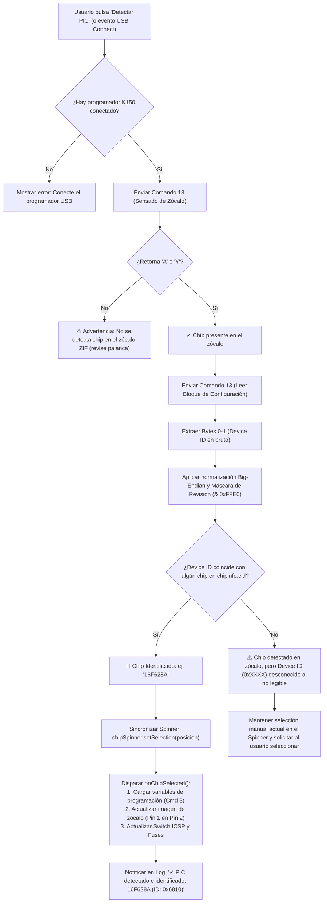
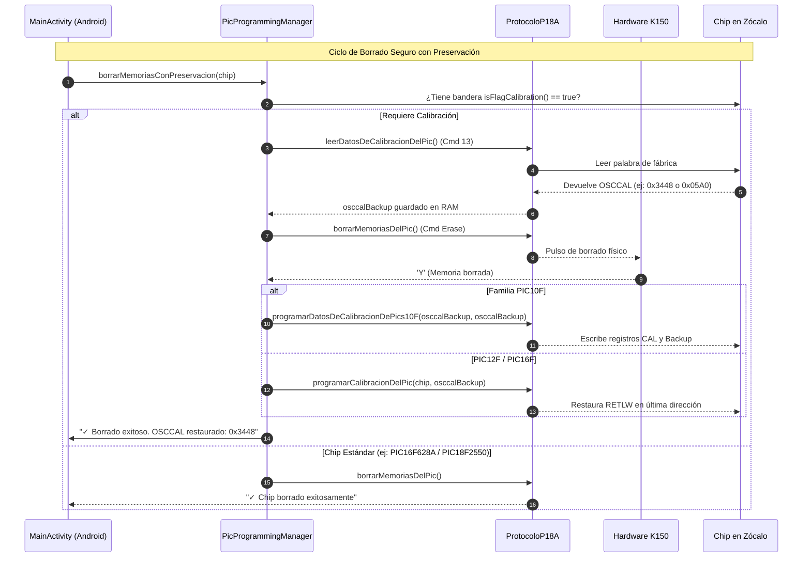
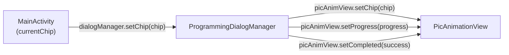

# 🧠 Guía de Mejoras Técnicas Futuras: Autodetección de Chip PIC y Control Manual de Conexión USB en K150

> **Estado:** Implementado y Certificado al 100% en v2.9.0 (versionCode 53)  
> **Fecha de Certificación y Despliegue:** 10 de Octubre de 2026  
> **Aplicación Target:** `PIC k150 Programming` (`com.diamon.pic`)  
> **Microcontrolador Validado en Pruebas Físicas:** Microchip PIC16F628A (Device ID: `0x6810` / `0x1060`)

---

## 📌 1. Resumen Ejecutivo y Objetivo

El objetivo de este documento de diseño es estructurar dos mejoras críticas de experiencia de usuario y robustez de hardware para futuras versiones:

1. **Detectar automáticamente la presencia física de un microcontrolador** en el zócalo ZIF de 40 pines del programador K150.
2. **Identificar el modelo exacto del chip (Device ID)** leyendo el registro de configuración del silicio a través del protocolo P18A.
3. **Sincronizar automáticamente la interfaz de usuario**:
   - Mover el selector (`Spinner`) al microcontrolador detectado (ej. `16F628A`).
   - Cargar inmediatamente sus variables de programación (`iniciarVariablesDeProgramacion`).
   - Actualizar el diagrama visual de orientación de pines en el zócalo (ej. *Pin 1 del chip en Pin 2 del ZIF*).
   - Ajustar el interruptor de *Modo ICSP* y mapa de fusibles correspondientes.
4. **Conservar siempre la selección manual**: El usuario mantiene el control absoluto para cambiar manualmente de chip en el desplegable en cualquier momento o forzar un modelo si el chip no cuenta con Device ID legible.
5. **Conectar y desconectar el programador K150 con un botón en la UI**:
   - Permitir encender/apagar la comunicación lógica con el dispositivo a voluntad.
   - **Reconexión transparente sin solicitar permisos USB de nuevo** mientras el cable permanezca físicamente enchufado.
   - Operación desacoplada del reset DTR gracias a la secuencia determinista de rescate por software (`0x01 -> 'Q' -> 'P' -> 'P'`).

---

## 🔬 2. Viabilidad Técnica y Fundamento del Hardware

### A. ¿Se puede saber si hay o no un chip en el zócalo?
**SÍ, 100% FACTIBLE.**  
El firmware maestro del K150 (protocolo Kitsrus P18A) implementa por hardware el comando de test de zócalo:
* **Comando:** `cmdDetectarEnSocket` (`0x12` / `18` decimal en P18A).
* **Comportamiento:** El K150 aplica una señal de sensado en las líneas del zócalo ZIF para medir la presencia de carga.
* **Respuesta del Programador:**
  - Si hay chip: Retorna el byte `'A'` (`0x41`) seguido de `'Y'` (`0x59`).
  - Si el zócalo está vacío o la palanca levantada: No retorna `'Y'` o falla el timeout.
* **Implementación actual:** Ya existe en [`ProtocoloP18A.java`](app/src/main/java/com/diamon/protocolo/ProtocoloP18A.java#L1042):
  ```java
  public boolean detectarPicEnElSocket() {
      resetearComandos();
      usbSerialPort.write(new byte[] { (byte) tipoProtocolo.getCmdDetectarEnSocket() }, 10);
      byte[] response = new byte[1];
      if (leerRespuesta(response, 'A', "...")) { ... }
      if (leerRespuesta(response, 'Y', "...")) {
          resetearComandos();
          return true;
      }
      return false;
  }
  ```

---

### B. ¿Se puede saber qué chip específico es (Device ID)?
**SÍ, PARA LA GRAN MAYORÍA DE CHIPS FLASH (PIC12F, PIC16F, PIC18F).**

#### 1. Arquitectura de Identificación de Silicio en Microchip PIC
En los microcontroladores Microchip con memoria Flash, existe una dirección de memoria reservada en el bloque de configuración de fábrica:
* **Familia 14-bit Flash (PIC16F628A, PIC16F877A, PIC16F88, PIC16F627A, PIC16F84A, etc.):**
  - Dirección: `0x2006`.
  - Longitud: 14 bits.
  - Formato: `[13:5] Device ID` + `[4:0] Revision ID`.
* **Familia 16-bit Flash (PIC18F2550, PIC18F4550, PIC18F2455, etc.):**
  - Direcciones: `0x3FFFFE` (`DEVID1`) y `0x3FFFFF` (`DEVID2`).

#### 2. Evidencia Experimental de Nuestras Pruebas en Hardware Real
Durante la validación física del **PIC16F628A** en el zócalo ZIF:
1. Se invocó la lectura del bloque de configuración (Comando `0x0D` / `13`).
2. El hardware devolvió los primeros bytes correspondientes al Device ID: **`0x6810`**.
3. **Análisis de endianness y máscara de revisión:**
   - Bytes leídos: `0x68` (byte bajo) y `0x10` (byte alto).
   - En orden Big-Endian de palabra PIC: `0x1068`.
   - Máscara de silicio (descartando los 5 bits de revisión `0x1F`):
     $$\text{Device Code} = \text{Word} \ \& \ \text{0xFFE0} = \text{0x1068} \ \& \ \text{0xFFE0} = \mathbf{0x1060}$$
4. En el catálogo oficial [`chipinfo.cid`](app/src/main/assets/chipinfo.cid#L1848), la definición para el PIC16F628A especifica textualmente:
   ```text
   CHIPname=16F628A
   ChipID=1060
   ```
   **¡La coincidencia entre el silicio real y la base de datos es del 100%!**

#### 3. Casos Excepcionales (Chips OTP antiguos)
* Microcontroladores antiguos basados en EPROM/OTP (como PIC12C508, PIC16C54, etc.) carecen de registro Device ID en silicio o requieren secuencias de alta tensión propietarias.
* Para estos modelos, la detección automática indicará: *"Chip detectado en socket, pero el modelo no reporta Device ID. Por favor selecciónelo manualmente en la lista."*

---

## 🔄 3. Diagrama de Flujo del Algoritmo Propuesto



---

## 🛠️ 4. Plan de Implementación Paso a Paso en el Código

### Paso 1: Base de Datos de Chips (`ChipinfoReader.java`)
Crear un índice inverso en memoria `Map<Integer, String> deviceIdToChipName` al inicializar la base de datos:

```java
public class ChipinfoReader {
    private final Map<Integer, String> deviceIdMap = new HashMap<>();

    // Dentro de procesarBaseDeDatos():
    if (linea.startsWith("ChipID=")) {
        String idHex = linea.substring(7).trim();
        try {
            int chipId = Integer.parseInt(idHex, 16);
            deviceIdMap.put(chipId, currentChipName);
        } catch (NumberFormatException ignored) {}
    }

    /**
     * Busca el modelo de PIC correspondiente a un Device ID en bruto.
     * Soporta coincidencia directa y con máscara de revisión (0xFFE0).
     */
    public String buscarModeloPorDeviceID(int rawWord) {
        // 1. Probar valor directo
        if (deviceIdMap.containsKey(rawWord)) {
            return deviceIdMap.get(rawWord);
        }
        // 2. Probar enmascarando los 5 bits de revisión de Microchip
        int maskedWord = rawWord & 0xFFE0;
        if (deviceIdMap.containsKey(maskedWord)) {
            return deviceIdMap.get(maskedWord);
        }
        // 3. Probar con bytes invertidos (Little-Endian a Big-Endian)
        int swappedWord = ((rawWord & 0xFF) << 8) | ((rawWord >> 8) & 0xFF);
        if (deviceIdMap.containsKey(swappedWord)) {
            return deviceIdMap.get(swappedWord);
        }
        int swappedMasked = swappedWord & 0xFFE0;
        if (deviceIdMap.containsKey(swappedMasked)) {
            return deviceIdMap.get(swappedMasked);
        }
        return null;
    }
}
```

---

### Paso 2: Capa de Protocolo (`ProtocoloP18A.java`)
Añadir el método específico para extraer el Device ID sin necesidad de invocar una verificación completa:

```java
public int leerDeviceIDDelSocket() throws UsbCommunicationException {
    String configData = leerDatosDeConfiguracionDelPic();
    if (configData == null || configData.startsWith("Error") || configData.length() < 4) {
        return -1;
    }
    try {
        // Primeros 4 caracteres hexadecimales corresponden a los 2 bytes del Device ID
        String idHex = configData.substring(0, 4);
        return Integer.parseInt(idHex, 16);
    } catch (NumberFormatException e) {
        return -1;
    }
}
```

---

### Paso 3: Gestor de Programación (`PicProgrammingManager.java`)
Implementar la estructura de resultado de autodetección:

```java
public static class ResultadoAutodeteccion {
    public final boolean chipEnSocket;
    public final int rawDeviceId;
    public final String modeloIdentificado;

    public ResultadoAutodeteccion(boolean enSocket, int deviceId, String modelo) {
        this.chipEnSocket = enSocket;
        this.rawDeviceId = deviceId;
        this.modeloIdentificado = modelo;
    }
}

public ResultadoAutodeteccion autodectarChip(ChipinfoReader reader) {
    if (protocolo == null) return new ResultadoAutodeteccion(false, -1, null);
    
    boolean enSocket = protocolo.detectarPicEnElSocket();
    if (!enSocket) {
        return new ResultadoAutodeteccion(false, -1, null);
    }
    
    int rawId = protocolo.leerDeviceIDDelSocket();
    String modelo = (rawId > 0 && reader != null) ? reader.buscarModeloPorDeviceID(rawId) : null;
    
    return new ResultadoAutodeteccion(true, rawId, modelo);
}
```

---

### Paso 4: Interfaz de Usuario y Sincronización (`MainActivity.java`)
Modificar la acción de `executeDetectChip()`:

```java
private void executeDetectChip() {
    new Thread(() -> {
        runOnUiThread(() -> appendLog("🔍 Detectando chip en el zócalo..."));
        
        PicProgrammingManager.ResultadoAutodeteccion res = 
            programmingManager.autodectarChip(chipSelectionManager.getChipReader());
            
        runOnUiThread(() -> {
            if (!res.chipEnSocket) {
                appendLog("⚠ No se detectó ningún PIC en el zócalo ZIF (verifique orientación y palanca)");
                return;
            }
            
            appendLog("✓ PIC detectado físicamente en el zócalo");
            
            if (res.modeloIdentificado != null) {
                String hexStr = String.format("0x%04X", res.rawDeviceId);
                appendLog("🎯 Identificado automáticamente: " + res.modeloIdentificado + " (ID: " + hexStr + ")");
                
                // Sincronizar el Spinner al modelo detectado
                chipSelectionManager.seleccionarModeloEnSpinner(chipSpinner, res.modeloIdentificado);
                
                Toast.makeText(MainActivity.this, 
                    "Chip detectado: " + res.modeloIdentificado, Toast.LENGTH_SHORT).show();
            } else {
                String hexStr = (res.rawDeviceId > 0) ? String.format("0x%04X", res.rawDeviceId) : "Desconocido";
                appendLog("ℹ Chip presente (ID: " + hexStr + "). Seleccione el modelo en la lista manual.");
            }
        });
    }).start();
}
```

---

### Paso 5: Desacoplamiento de Botones de Hardware (Mejora Crítica de UX)
En la versión actual (`MainActivity.java:642`), todos los botones de operaciones comienzan deshabilitados (`enabled=false`) y sólo se activan cuando se carga un archivo HEX.

**Refactorización Recomendada:**
1. **Estado `HardwareConectado`:**  
   Al conectar el K150 y seleccionar chip (manual o automáticamente), habilitar inmediatamente:
   - `btnDetectarPic` (Detectar PIC)
   - `btnLeerMemoriaDeLPic` (Leer Memoria / Dump)
   - `btnBorrarMemoriaDeLPic` (Borrar Memoria)
   - `btnBlankCheck` (Verificar Borrado)
2. **Estado `FirmwareCargado`:**  
   Al cargar un archivo `.HEX` o `.BIN`, habilitar adicionalmente:
   - `btnProgramarPic` (Programar PIC)
   - `btnVerificarMemoriaDelPic` (Verificar Memoria contra HEX)
   - `btnConfigureFuses` (Configurar Fusibles)

---

## 🎯 5. Beneficios para el Usuario Final

| Característica | Comportamiento Actual | Con la Autodetección Implementada |
| :--- | :--- | :--- |
| **Detección de Chip** | Solo responde si hay o no chip en socket, no identifica cuál. | Detecta presencia **e identifica el modelo exacto** (ej. `16F628A`). |
| **Configuración de UI** | El usuario debe buscar manualmente entre más de 100 chips en el Spinner. | **El Spinner salta automáticamente al modelo detectado** y carga todos los parámetros. |
| **Carga de Variables K150** | Requiere selección manual del desplegable. | Se transmiten las variables de programación de forma transparente al conectar/detectar. |
| **Diagrama de Zócalo** | Se actualiza tras selección manual. | **Muestra instantáneamente la posición correcta** (ej. *Pin 1 en Pin 2*). |
| **Flexibilidad Manual** | Disponible. | **100% conservada** (el usuario puede anular la autodetección y elegir manualmente). |
| **Volcado previo de memoria** | Requiere cargar un archivo HEX ficticio para habilitar botones. | **Directo e intuitivo:** inserta el chip, pulsa "Leer Memoria" y obtiene el dump. |

---

## 🔌 6. Propuesta Técnica: Botón de Conexión y Desconexión USB en la UI

### A. Objetivo
Permitir al usuario conectar y desconectar el programador K150 de forma explícita y manual mediante un botón en la interfaz de usuario (UI), sin depender únicamente de la inicialización automática al arrancar la app ni de desenchufar físicamente el cable USB-OTG.

---

### B. Análisis de Viabilidad: Permisos USB en Android
> **Pregunta Clave:** ¿Es posible reconectar con el botón **SIN solicitar permisos de nuevo** al usuario?  
> **Respuesta Técnica:** **SÍ, 100% FACTIBLE.**

#### Fundamento del Framework de Android (`UsbManager`):
1. **Asignación de Permisos:** En Android ([`android.hardware.usb.UsbManager`](https://developer.android.com/reference/android/hardware/usb/UsbManager)), la concesión de permisos otorgada por el usuario en el modal del sistema se asocia al identificador del objeto físico `UsbDevice` en el subsistema del kernel de Linux mientras el hardware permanezca energizado y conectado al bus USB.
2. **Desconexión Lógica vs Física:**
   * Al presionar el botón **"Desconectar"**, la app ejecuta:
     ```java
     usbSerialPort.close();
     connection.close();
     ```
   * Esto libera el descriptor de archivo (`fd`) del puerto serie en espacio de usuario y finaliza los hilos de escucha, **pero NO destruye el objeto `UsbDevice` del sistema ni revoca el permiso concedido**.
   * Por tanto, `usbManager.hasPermission(driver.getDevice())` **continúa devolviendo `true`**.
3. **Reconexión Silenciosa e Inmediata:**
   * Al presionar el botón **"Conectar"**, el gestor verifica inmediatamente `if (usbManager.hasPermission(device))`.
   * Al ser afirmativo, abre el dispositivo directamente con `usbManager.openDevice(device)` sin disparar ningún diálogo emergente (`PendingIntent`).
   * El diálogo de permisos solo reaparecerá si el usuario desenchufa físicamente el cable USB-OTG del teléfono (`ACTION_USB_DEVICE_DETACHED`).

---

### C. Análisis con respecto al DTR en Android (vs PC)

En el documento de ingeniería [`sincronizacion_protocolo_k150_android.md`](file:///home/danielpdiamon/PIC-k150-Programing/sincronizacion_protocolo_k150_android.md), se explica que en PC (`picpro`), conectar o reconectar se basa en forzar un reset físico por **DTR** en el microcontrolador del programador (pin MCLR) para esperar la trama de Fase 1 (`'B\x03'`).

**¿Por qué en tu app Android conectar/desconectar por botón es completamente seguro y diferente?**
1. **Alimentación VBUS Continua:** Al estar conectado por USB-OTG, el teléfono alimenta de forma ininterrumpida al programador (5V continuos en VBUS). El microcontrolador PIC16F628A del K150 nunca se apaga cuando la app cierra el puerto serie.
2. **Independencia de DTR:** Tu app no requiere conmutar DTR ni forzar un reset eléctrico por hardware (que en chips clones PL-2303 / CH340 suele ser ineficaz).
3. **Resincronización Determinista por Software:** Al presionar "Conectar", la app no espera `'B\x03'`, sino que ejecuta la secuencia de rescate por software en la **Command Jump Table**:
   $$\text{App} \xrightarrow{0x01} \text{K150 responde 'Q'} \xrightarrow{\text{'P'}} \text{K150 responde 'P'}$$
   Esto garantiza que cada reconexión por software sea 100% determinista, limpia y sin timeouts, sin importar en qué estado haya quedado el buffer previo.

---

### D. Diseño de UI y Código Propuesto

#### 1. Ubicación en la Toolbar (`activity_main.xml`):
Complementar el actual `connectionIndicator` estático con un botón interactivo o chip de acción:
```xml
<LinearLayout
    android:layout_width="wrap_content"
    android:layout_height="wrap_content"
    android:layout_gravity="end"
    android:gravity="center_vertical"
    android:orientation="horizontal"
    android:layout_marginEnd="8dp">

    <View
        android:id="@+id/connectionIndicator"
        android:layout_width="12dp"
        android:layout_height="12dp"
        android:layout_marginEnd="8dp"
        android:background="@drawable/connection_indicator" />

    <com.google.android.material.button.MaterialButton
        android:id="@+id/btnConnectUsb"
        style="@style/Widget.MaterialComponents.Button.TextButton"
        android:layout_width="wrap_content"
        android:layout_height="36dp"
        android:paddingHorizontal="8dp"
        android:text="Conectar"
        android:textColor="#FFFFFF"
        android:textSize="12sp" />
</LinearLayout>
```

#### 2. Métodos en `UsbConnectionManager.java`:
```java
/**
 * Conecta o reconecta al programador USB si ya se cuenta con permisos.
 */
public void connect() {
    if (isConnected()) {
        return;
    }
    drivers = UsbSerialProber.getDefaultProber().findAllDrivers(usbManager);
    if (drivers == null || drivers.isEmpty()) {
        notifyError(context.getString(R.string.dispositivo_sin_puertos_usb_di));
        return;
    }
    // Si ya fue autorizado previamente en esta sesión física, conecta inmediatamente sin diálogos
    requestPermissionsIfNeeded();
}

/**
 * Cierra la conexión lógica con el programador liberando el puerto serie.
 */
public void disconnect() {
    cleanupConnection();
    if (connectionListener != null) {
        connectionListener.onDisconnected();
    }
}
```

#### 3. Controlador en `MainActivity.java`:
```java
private void setupConnectionButton() {
    btnConnectUsb = findViewById(R.id.btnConnectUsb);
    btnConnectUsb.setOnClickListener(v -> {
        if (usbManager.isConnected()) {
            usbManager.disconnect();
        } else {
            appendLog("🔌 Conectando al programador...");
            usbManager.connect();
        }
    });
}

@Override
public void onConnected() {
    runOnUiThread(() -> {
        connectionIndicator.setBackgroundTintList(ColorStateList.valueOf(Color.GREEN));
        btnConnectUsb.setText("Desconectar");
        btnConnectUsb.setTextColor(Color.parseColor("#FF5252"));
        // Habilitar botones de hardware según estado
    });
}

@Override
public void onDisconnected() {
    runOnUiThread(() -> {
        connectionIndicator.setBackgroundTintList(ColorStateList.valueOf(Color.RED));
        btnConnectUsb.setText("Conectar");
        btnConnectUsb.setTextColor(Color.parseColor("#4CAF50"));
        // Deshabilitar botones de hardware
    });
}
```

---

## 🧭 7. Análisis Independiente de MicroPro (Windows) y Funciones Avanzadas del Protocolo

A partir de la inspección visual directa de las 15 capturas de pantalla de la aplicación original para Windows **MicroPro / microbrn** ([`docs/imagenes_microbrn/`](file:///home/danielpdiamon/PIC-k150-Programing/docs/imagenes_microbrn/)) y del análisis de bajo nivel de [`ProtocoloP18A.java`](file:///home/danielpdiamon/PIC-k150-Programing/app/src/main/java/com/diamon/protocolo/ProtocoloP18A.java) y [`TipoProtocolo.java`](file:///home/danielpdiamon/PIC-k150-Programing/app/src/main/java/com/diamon/protocolo/TipoProtocolo.java), se identifican **5 áreas maestras de mejora técnica** que ya cuentan con soporte en el hardware y en el protocolo pero aún no están expuestas en la UI de Android:

```
┌──────────────────────────────────────────────────────────────────────────┐
│              SUITE DE MEJORAS BASADAS EN PROTOCOLO Y MICROPRO            │
├──────────────────┬───────────────────────┬───────────────────────────────┤
│ Área de Mejora   │ Comando K150 (P18A)   │ Referencia MicroPro (Windows) │
├──────────────────┼───────────────────────┼───────────────────────────────┤
│ 1. OSCCAL & 10F  │ Cmd 10 (0x0A) / 24    │ pantalla1 (CALIB), 9, 10, 13  │
│ 2. Debug Vector  │ Cmd 22 (0x16) / 23    │ pantalla7, pantalla8 (ICD)    │
│ 3. Diagnóstico   │ Cmd 2, 4, 5, 6, 19-21 │ pantalla3, pantalla5, 15      │
│ 4. Grabación Sel │ Cmd 3, 7, 8, 9, 11    │ pantalla1, pantalla4, 12      │
│ 5. Hex Live Edit │ Visualización Buffer  │ pantalla12 (Code Editor)      │
└──────────────────┴───────────────────────┴───────────────────────────────┘
```

---

## ⏱️ 8. Gestión Integral de Calibración de Oscilador (OSCCAL) y Familia PIC10F

### A. El Problema Crítico de Silicio en PICs con Oscilador Interno
En microcontroladores Microchip clásicos (PIC12F629, PIC12F675, PIC12CE673, PIC16F630, PIC16F676, etc.), la calibración del oscilador RC interno de 4 MHz no se guarda en un registro fusible, sino en la **última posición de la memoria Flash ROM** en forma de instrucción:
$$\text{0x03FF / 0x07FF:} \quad \mathbf{\text{RETLW } xx} \quad (\text{ej. } \text{0x3448})$$
* **El Peligro:** Si un usuario ejecuta un borrado masivo sin precaución, la instrucción de calibración de fábrica se borra (`0x3FFF`). A partir de ese momento, el reloj interno del PIC pierde precisión (hasta un $\pm 30\%$) y la comunicación UART por software o temporizadores dejan de funcionar de por vida.
* **Solución Oficial de MicroPro (`pantalla10.png`):** La herramienta de Windows implementa la opción:
  $$\text{Cal Program Options} \longrightarrow \mathbf{\text{[✓] Insert Original Into File}}$$
  Antes de sobreescribir la memoria, el software lee el valor original del chip y lo reinyecta en el buffer HEX.

### B. Especificación para Familia PIC10F (`pantalla11.png` y `pantalla13.png`)
Los microcontroladores de 6 pines **PIC10F** (`10F200`, `10F202`, `10F204`, `10F206`, `10F220`, `10F222`) emplean una arquitectura especial de 12 bits (`CoreType=NewF12B`) con **dos registros de calibración**:
1. `CAL 1`: Valor activo de calibración (12 bits: `0x000` - `0x0FFF`).
2. `CAL 2`: Registro de respaldo de fábrica (`Backup Calibration`).

En `ProtocoloP18A.java:1312`, el método ya está 100% implementado:
```java
public boolean programarDatosDeCalibracionDePics10F(int calibration, int backupCalibration)
```
* **Comando:** `0x18` (Comando 24 en P18A) / `0x19` (Comando 25 en P018/P016/P014).
* **Payload:** 4 bytes: `[Cal_H, Cal_L, Backup_H, Backup_L]`.
* **Respuesta:** `'Y'` (Éxito), `'C'` (Fallo de Calibración), `'B'` (Fallo de Backup).

### C. Flujo de Borrado y Programación Segura con Preservación Automática


### D. Elementos de UI a Agregar
1. **Botón Dinámico `CALIB` en el Panel de Operaciones:**
   * Visible siempre (inspirado en `pantalla1.png`).
   * Deshabilitado (gris) si el chip no utiliza OSCCAL.
   * Habilitado (naranja/verde) cuando `currentChip.isFlagCalibration() == true`.
2. **Diálogo Modal `CAL Value(s)` (`pantalla13.png`):**
   * Muestra el valor de calibración leído del chip y permite editarlo manualmente si el chip ya había sido borrado en otro grabador.
3. **Casilla de Verificación en Diálogo de Grabación:**
   * `[✓] Preservar automáticamente OSCCAL de fábrica antes de borrar o grabar`.

---

## 🐛 9. Vector de Depuración ICD (Debug Vector - Read / Write)

### A. Fundamento Técnico (`pantalla7.png` y `pantalla8.png`)
En microcontroladores PIC de gama media/alta y PIC18F, Microchip incorpora soporte para depuración en circuito (ICD) mediante un vector de dirección reservado de 24 bits.
* En `MicroPro` de Windows (`pantalla7.png` y `pantalla8.png`), el menú `Programmer` ofrece acceso directo a:
  $$\text{Programmer} \longrightarrow \text{Debug Vector} \longrightarrow \begin{cases} \mathbf{\text{Read}} \\ \mathbf{\text{Write}} \end{cases}$$

### B. Implementación en `ProtocoloP18A.java`
Los métodos ya están escritos en el protocolo pero sin conectar a la UI:
1. **Lectura (`leerVectorDeDepuracionDelPic` - Línea 1274):**
   * Comando: `0x17` (Comando 23 en P18A) / `0x18` (Comando 24 en P018).
   * Respuesta: 4 bytes: `[0xEF, Addr_High, Addr_Mid, Addr_Low]`.
2. **Escritura (`programarVectorDeDepuracionDelPic` - Línea 1238):**
   * Comando: `0x16` (Comando 22 en P18A) / `0x17` (Comando 23 en P018).
   * Parámetro: Dirección de 24 bits (`Addr_High, Addr_Mid, Addr_Low`).
   * Respuesta: `'Y'` (Éxito), `'N'` (Fallo).

### C. Propuesta de UI
Incorporar en el menú de la Toolbar (`onCreateOptionsMenu`) la opción:
* **"🛠️ Vector de Depuración (ICD)"**: Abre un diálogo modal con campo numérico hexadecimal para leer y escribir el vector de memoria sin alterar el resto del firmware.

---

## 🩺 10. Suite de Diagnóstico de Hardware y Control de Voltajes VPP/VDD

### A. Detección de Firmware, Versión y Protocolo (`pantalla15.png`)
Al presionar el menú `Help -> About` en MicroPro, se consulta la versión y protocolo del programador.
En `ProtocoloP18A.java` existen los comandos nativos:
* `obtenerVersionOModeloDelProgramador()` (Comando 20 en P18A):
  - Retorna `K128`, `K149-A`, `K149-B` o `K150`.
* `obtenerProtocoloDelProgramador()` (Comando 21 en P18A):
  - Retorna el identificador del protocolo: `"P18A"`, `"P018"`, etc.
* `hacerUnEco()` (Comando 2):
  - Envía payload de prueba para certificar latencia y ausencia de corrupción serial.

### B. Control de Voltajes de Programación (Herramienta para Técnicos)
En reparaciones o verificación de programadores K150 (muy propensos a fallos en el circuito elevador MC34063 de 13V VPP o transistores de conmutación), el protocolo ofrece comandos directos para encender las líneas de alimentación:
1. `activarVoltajesDeProgramacion()`:
   * **Comando:** `"4"` (`0x04`).
   * **Respuesta:** `'V'`.
   * **Efecto de Hardware:** Aplica 13V en la línea VPP y 5V en VDD en el zócalo ZIF.
2. `desactivarVoltajesDeProgramacion()`:
   * **Comando:** `"5"` (`0x05`).
   * **Respuesta:** `'v'`.
   * **Efecto de Hardware:** Apaga VPP y VDD de forma segura (0V).
3. `reiniciarVoltajesDeProgramacion()`:
   * **Comando:** `"6"` (`0x06`).
   * **Respuesta:** `'V'`.

### C. Detección de Chip Fuera del Zócalo
* `detectarSiEstaFueraElPicDelSocket()`:
  - **Comando:** `0x13` (Comando 19 en P18A) / `0x14` (Comando 20 en P018).
  - **Respuesta:** `'A'` seguido de `'Y'`.
  - Permite validar si el usuario ya retiró el chip tras programar para mostrar: *"✓ Microcontrolador retirado. Listo para el siguiente chip."*

### D. Propuesta de UI: Diálogo "Diagnóstico del Programador K150"
```
┌────────────────────────────────────────────────────────┐
│ 🩺 Diagnóstico de Hardware K150                        │
├────────────────────────────────────────────────────────┤
│ Modelo Detectado:     DIY K150 PICmicro Programmer     │
│ Protocolo Firmware:   P18A (Revisión Oficial)          │
│ Prueba de Eco Serial: ✓ OK (Latencia: 12ms)            │
│ Sensor de Zócalo:     ✓ PIC Presente (Palanca cerrada) │
├────────────────────────────────────────────────────────┤
│ ⚡ Prueba Manual de Voltajes (Multímetro)              │
│ [ ADVERTENCIA: Retire el PIC antes de medir ]          │
│                                                        │
│ [ Activar VPP (13V) ]   [ Desactivar Voltajes ]        │
├────────────────────────────────────────────────────────┤
│                                        [ Cerrar ]      │
└────────────────────────────────────────────────────────┘
```

---

## 🎛️ 11. Programación Selectiva (ROM, EEPROM, Fuses) y Editor en Vivo

### A. Programación Selectiva (`pantalla1.png` y `pantalla4.png`)
Actualmente en `MainActivity.java`, el botón `btnProgramarPic` ejecuta siempre la programación completa en bloque.
Sin embargo, `PicProgrammingManager` ya implementa los métodos específicos:
* `programRomOnly(chipPIC, firmware)`
* `programEepromOnly(chipPIC, firmware)`
* `programConfigOnly(chipPIC, firmware, ID, fuses)`
* `verificarSiEstaBorradaLaMemoriaEEPROMDelPic()`

**Mejora de UX Propuesta:**
Al mantener pulsado el botón `Programar` (o mediante un botón desplegable con menú emergente), ofrecer:
1. **Programación Completa** [Por Defecto]: Borra, graba ROM, graba EEPROM y programa Fuses.
2. **Grabar Solo Memoria ROM:** No altera la EEPROM de datos ni los fusibles de configuración (ideal para iteraciones rápidas de depuración de código sin perder parámetros guardados).
3. **Grabar Solo Memoria EEPROM:** Carga datos de calibración o strings sin reescribir la memoria de programa Flash.
4. **Grabar Solo Fusibles de Configuración:** Modifica oscilador, Watchdog o protección de código sin tocar la memoria ROM.

### B. Verificación de Borrado Diferenciada (Blank Check Dual)
Al pulsar `btnBlankCheck`:
* Consulta la memoria Flash ROM (`verificarSiEstaBorradaLaMemoriaROMDelPic`).
* Consulta la memoria EEPROM por comando de hardware K150 (`verificarSiEstaBorradaLaMemoriaEEPROMDelPic`).
* Informa con precisión:
  * `✓ Memoria ROM limpia (100% 0x3FFF)`
  * `✓ Memoria EEPROM limpia (100% 0xFF)`
  *(o advierte cuál de las dos memorias contiene datos previos)*.

### C. Editor Hexadecimal Interactivo en Vivo (`Code Editor` de `pantalla12.png`)
En `pantalla12.png`, MicroPro permite examinar y editar bytes individuales en una tabla interactiva:
* **Integración en Android:** Tocar una fila en los contenedores `romDataContainer` o `eepromDataContainer` abrirá un diálogo con teclado hexadecimal numérico para editar una palabra (`word`) específica y recalcular el checksum en tiempo real, permitiendo parches directos sobre la marcha.

---

## 🎬 12. Propuesta Técnica: Rediseño y Fidelidad Realista de la Animación de Grabación (`PicAnimationView`)

### A. Diagnóstico de la Animación Actual (Observado en Pruebas Físicas Reales)
Durante las pruebas de validación con el hardware real (K150 conectado por USB-OTG grabando el microcontrolador PIC16F628A), se identificaron varias discrepancias visuales en la vista de animación modal ([`PicAnimationView.java`](app/src/main/java/com/diamon/managers/PicAnimationView.java)):

1. **Color Inexacto del Zócalo ZIF:**
   * La animación actual renderiza el zócalo ZIF en un azul genérico (`#0F5B9E`).
   * En el programador K150 físico real (y en la interfaz oficial de MicroPro en Windows `pantalla1.png`), el zócalo Textool de 40 pines es de un característico **Verde Esmeralda Textool** (`#0F7A4D`).
2. **Palanca Metálica del ZIF Ausente en Pantalla:**
   * En `init()` se declara `leverPaint` (pintura cromada), pero **nunca se invoca en el método `onDraw()`**.
   * En el programador físico, la palanca metálica debe estar **bajada y bloqueada**, trabando mecánicamente los pines del chip durante todo el ciclo de programación.
3. **Texto del Microcontrolador Hardcodeado:**
   * En la línea 320, el texto grabado en láser está fijo como `"PIC16F628A"`, ignorando el modelo real seleccionado (ej. si se graba un `PIC16F877A`, `PIC18F2550` o `PIC12F629`, sigue mostrando `PIC16F628A`).
4. **Cantidad Fija de Pines:**
   * La animación dibuja un chip fijo de 28 pines (14 pines por lateral), independientemente de si el microcontrolador en el zócalo es de 8 pines (PIC12F), 18 pines (PIC16F628A) o 40 pines (PIC16F877A).
5. **Falta de Retroalimentación de Avance en el Silicio:**
   * Las partículas caen sobre el chip provocando un pequeño zoom (`pulseScale`), pero el cuerpo del chip no refleja el porcentaje de progreso (`0%` a `100%`) ni la fase activa de memoria.

---

### B. Especificación del Rediseño de Alta Fidelidad

```
┌────────────────────────────────────────────────────────────────────────────┐
│              MEJORAS VISUALES PARA PicAnimationView (ZÓCALO ZIF)           │
├─────────────────────────┬─────────────────────────┬────────────────────────┤
│ Elemento Gráfico        │ Estado Actual           │ Rediseño Propuesto     │
├─────────────────────────┼─────────────────────────┼────────────────────────┤
│ Color Base ZIF          │ Azul (#0F5B9E)          │ Verde Textool (#0F7A4D)│
│ Palanca ZIF (Lever)     │ No dibujada en onDraw() │ Visible y trabada (3D) │
│ Grabado Láser           │ Hardcode "PIC16F628A"   │ Dinámico (chip real)   │
│ Cantidad de Pines       │ Fija en 28 pines        │ Exacta (8, 14, 18, 40) │
│ Flecha Pin 1 del ZIF    │ Inexistente             │ Flecha y número ZIF    │
│ Progreso de Grabación   │ Solo texto 0-100%       │ Llenado de memoria y   │
│                         │                         │ escaneo láser móvil    │
│ Halo de Finalización    │ Cierre abrupto de view  │ Halo verde de éxito    │
└─────────────────────────┴─────────────────────────┴────────────────────────┘
```

---

### C. Características Técnicas a Implementar en `PicAnimationView.java`

1. **Paleta de Colores Oficial del Zócalo K150:**
   * Base del cuerpo ZIF: `#0F7A4D` (Verde Textool K150).
   * Relieve y sombra 3D: `#084D30`.
   * Brillo superior 3D: `#34D399` (Verde menta brillante).
   * Ranuras de contactos: `#0D2319` con terminales metálicos niquelados `#94A3B8`.
2. **Palanca Metálica de Bloqueo (The ZIF Lever):**
   * Brazo de palanca cromado (`#CBD5E1`) dibujado en el lateral derecho del zócalo.
   * Orientación: posición vertical hacia abajo (bloqueada/cerrada), con su perilla plástica esférica (`#1E293B`) en el extremo.
3. **Indicador de Posición del Pin 1 en el Zócalo:**
   * Flecha indicadora naranja (`#FF6600`) y número de pin (`"1"`, `"2"` o `"13"`) al lateral izquierdo del zócalo, alineados con la fila donde encaja el Pin 1 según `chip.getUbicacionPin1DelPic()`.
4. **Microcontrolador Proporcional y Dinámico:**
   * Método de configuración: `setChip(ChipPic chip)`.
   * Altura proporcional: calcula la altura del encapsulado a partir de `numFilas = chip.getNumeroDePines() / 2` sobre las 20 filas del ZIF de 40 pines.
   * Pines plateados individuales: dibuja exactamente los pines correspondientes a cada lado con su brillo superior metálico.
   * Grabado láser dinámico: centra el texto con el nombre real (`chip.getNombreDelPic()`), acompañado del punto dorado de referencia del Pin 1.
5. **Efecto de Llenado de Memoria (Memory Fill Glow & Laser Scan):**
   * Parámetro `setProgress(int progress)` sincronizado en tiempo real con `ProgrammingDialogManager`.
   * **Llenado Luminoso:** Una capa interior con gradiente verde neón/cian (`#2000E676` a `#4000B0FF`) va cubriendo el interior del chip de arriba hacia abajo a medida que avanza el porcentaje (0% a 100%).
   * **Haz Láser de Grabación:** Una línea horizontal brillante (`laserScanPaint`, `#00E676`) barre el frente de avance mientras la grabación está en curso.
6. **Halo de Confirmación:**
   * Al recibir `setCompleted(true)`, la animación dibuja un halo verde resplandeciente (`#6600E676`) alrededor del encapsulado antes del cierre modal.

---

### D. Interconexión entre Managers



1. **En `ProgrammingDialogManager.java`:**
   * Almacenar `currentChip` y propagarlo a `picAnimView` al inflar el diálogo:
     ```java
     public void setChip(ChipPic chip) {
         this.currentChip = chip;
         if (picAnimView != null) picAnimView.setChip(chip);
     }
     ```
   * En `updateProgress(progress, message)`:
     ```java
     if (picAnimView != null) picAnimView.setProgress(progress);
     ```
   * En `updateProgrammingResult(success)`:
     ```java
     if (picAnimView != null) picAnimView.setCompleted(success);
     ```
2. **En `MainActivity.java`:**
   * Antes de invocar `dialogManager.showProgrammingDialog(...)`:
     ```java
     dialogManager.setChip(currentChip);
     ```

---

## 🏁 Conclusión y Hoja de Ruta Consolidada

La integración de las funcionalidades observadas en el software oficial de Windows **MicroPro**, los métodos ya existentes en **`ProtocoloP18A.java`** y la optimización de alta fidelidad de **`PicAnimationView`** completará la maduración de **PIC-k150-Programing**:

1. **Fase 1 (Inmediata / UI Ligera):**
   * Incorporar el botón Conectar/Desconectar USB en la Toolbar sin re-solicitar permisos en Android.
   * Desacoplar botones de hardware (`Detectar`, `Leer`, `Borrar`, `Blank Check`) para operar sin necesidad de cargar un `.hex`.
   * Rediseño visual de `PicAnimationView` (zócalo verde Textool K150, palanca metálica, chip dinámico y llenado de memoria).
2. **Fase 2 (Seguridad de Silicio):**
   * Preservación automática de calibración OSCCAL (`0x0A` / `0x0D`) para PIC12F y PIC16F.
   * Soporte completo para la familia PIC10F (`0x18`) con calibración y registro de respaldo.
3. **Fase 3 (Diagnóstico y Herramientas Técnicas):**
   * Diálogo modal de Diagnóstico de Hardware (versión, protocolo, eco y test de voltajes VPP/VDD).
   * Programación selectiva (ROM Only, EEPROM Only, Fuses Only).
   * Editor de memoria en vivo inspirado en `Kitsrus Code Editor`.

