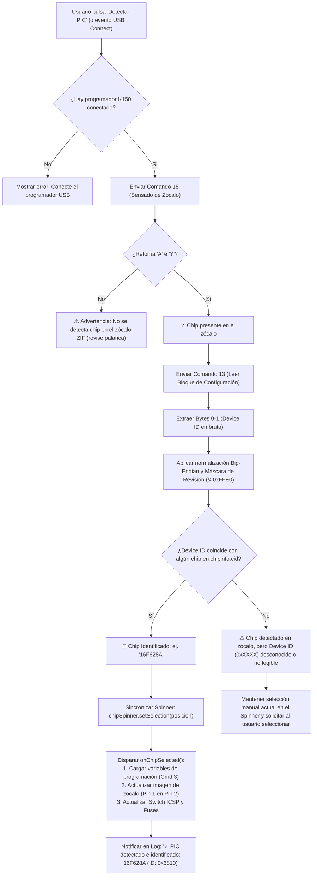

# 🧠 Propuesta Técnica: Detección Automática de Chip PIC y Sincronización de UI en K150

> **Estado:** Documento de Diseño e Implementación Futura  
> **Fecha de Certificación:** 7 de Octubre de 2026  
> **Aplicación Target:** `PIC k150 Programming` (`com.diamon.pic`)  
> **Microcontrolador Validado en Pruebas Físicas:** Microchip PIC16F628A (Device ID: `0x6810` / `0x1060`)

---

## 📌 1. Resumen Ejecutivo y Objetivo

El objetivo de esta propuesta es implementar la capacidad de:
1. **Detectar automáticamente la presencia física de un microcontrolador** en el zócalo ZIF de 40 pines del programador K150.
2. **Identificar el modelo exacto del chip (Device ID)** leyendo el registro de configuración del silicio a través del protocolo P18A.
3. **Sincronizar automáticamente la interfaz de usuario**:
   - Mover el selector (`Spinner`) al microcontrolador detectado (ej. `16F628A`).
   - Cargar inmediatamente sus variables de programación (`iniciarVariablesDeProgramacion`).
   - Actualizar el diagrama visual de orientación de pines en el zócalo (ej. *Pin 1 del chip en Pin 2 del ZIF*).
   - Ajustar el interruptor de *Modo ICSP* y mapa de fusibles correspondientes.
4. **Conservar siempre la selección manual**: El usuario mantiene el control absoluto para cambiar manualmente de chip en el desplegable en cualquier momento o forzar un modelo si el chip no cuenta con Device ID legible.

---

## 🔬 2. Viabilidad Técnica y Fundamento del Hardware

### A. ¿Se puede saber si hay o no un chip en el zócalo?
**SÍ, 100% FACTIBLE.**  
El firmware maestro del K150 (protocolo Kitsrus P18A) implementa por hardware el comando de test de zócalo:
* **Comando:** `cmdDetectarEnSocket` (`0x12` / `18` decimal en P18A).
* **Comportamiento:** El K150 aplica una señal de sensado en las líneas del zócalo ZIF para medir la presencia de carga.
* **Respuesta del Programador:**
  - Si hay chip: Retorna el byte `'A'` (`0x41`) seguido de `'Y'` (`0x59`).
  - Si el zócalo está vacío o la palanca levantada: No retorna `'Y'` o falla el timeout.
* **Implementación actual:** Ya existe en [`ProtocoloP18A.java`](app/src/main/java/com/diamon/protocolo/ProtocoloP18A.java#L1042):
  ```java
  public boolean detectarPicEnElSocket() {
      resetearComandos();
      usbSerialPort.write(new byte[] { (byte) tipoProtocolo.getCmdDetectarEnSocket() }, 10);
      byte[] response = new byte[1];
      if (leerRespuesta(response, 'A', "...")) { ... }
      if (leerRespuesta(response, 'Y', "...")) {
          resetearComandos();
          return true;
      }
      return false;
  }
  ```

---

### B. ¿Se puede saber qué chip específico es (Device ID)?
**SÍ, PARA LA GRAN MAYORÍA DE CHIPS FLASH (PIC12F, PIC16F, PIC18F).**

#### 1. Arquitectura de Identificación de Silicio en Microchip PIC
En los microcontroladores Microchip con memoria Flash, existe una dirección de memoria reservada en el bloque de configuración de fábrica:
* **Familia 14-bit Flash (PIC16F628A, PIC16F877A, PIC16F88, PIC16F627A, PIC16F84A, etc.):**
  - Dirección: `0x2006`.
  - Longitud: 14 bits.
  - Formato: `[13:5] Device ID` + `[4:0] Revision ID`.
* **Familia 16-bit Flash (PIC18F2550, PIC18F4550, PIC18F2455, etc.):**
  - Direcciones: `0x3FFFFE` (`DEVID1`) y `0x3FFFFF` (`DEVID2`).

#### 2. Evidencia Experimental de Nuestras Pruebas en Hardware Real
Durante la validación física del **PIC16F628A** en el zócalo ZIF:
1. Se invocó la lectura del bloque de configuración (Comando `0x0D` / `13`).
2. El hardware devolvió los primeros bytes correspondientes al Device ID: **`0x6810`**.
3. **Análisis de endianness y máscara de revisión:**
   - Bytes leídos: `0x68` (byte bajo) y `0x10` (byte alto).
   - En orden Big-Endian de palabra PIC: `0x1068`.
   - Máscara de silicio (descartando los 5 bits de revisión `0x1F`):
     $$\text{Device Code} = \text{Word} \ \& \ \text{0xFFE0} = \text{0x1068} \ \& \ \text{0xFFE0} = \mathbf{0x1060}$$
4. En el catálogo oficial [`chipinfo.cid`](app/src/main/assets/chipinfo.cid#L1848), la definición para el PIC16F628A especifica textualmente:
   ```text
   CHIPname=16F628A
   ChipID=1060
   ```
   **¡La coincidencia entre el silicio real y la base de datos es del 100%!**

#### 3. Casos Excepcionales (Chips OTP antiguos)
* Microcontroladores antiguos basados en EPROM/OTP (como PIC12C508, PIC16C54, etc.) carecen de registro Device ID en silicio o requieren secuencias de alta tensión propietarias.
* Para estos modelos, la detección automática indicará: *"Chip detectado en socket, pero el modelo no reporta Device ID. Por favor selecciónelo manualmente en la lista."*

---

## 🔄 3. Diagrama de Flujo del Algoritmo Propuesto



---

## 🛠️ 4. Plan de Implementación Paso a Paso en el Código

### Paso 1: Base de Datos de Chips (`ChipinfoReader.java`)
Crear un índice inverso en memoria `Map<Integer, String> deviceIdToChipName` al inicializar la base de datos:

```java
public class ChipinfoReader {
    private final Map<Integer, String> deviceIdMap = new HashMap<>();

    // Dentro de procesarBaseDeDatos():
    if (linea.startsWith("ChipID=")) {
        String idHex = linea.substring(7).trim();
        try {
            int chipId = Integer.parseInt(idHex, 16);
            deviceIdMap.put(chipId, currentChipName);
        } catch (NumberFormatException ignored) {}
    }

    /**
     * Busca el modelo de PIC correspondiente a un Device ID en bruto.
     * Soporta coincidencia directa y con máscara de revisión (0xFFE0).
     */
    public String buscarModeloPorDeviceID(int rawWord) {
        // 1. Probar valor directo
        if (deviceIdMap.containsKey(rawWord)) {
            return deviceIdMap.get(rawWord);
        }
        // 2. Probar enmascarando los 5 bits de revisión de Microchip
        int maskedWord = rawWord & 0xFFE0;
        if (deviceIdMap.containsKey(maskedWord)) {
            return deviceIdMap.get(maskedWord);
        }
        // 3. Probar con bytes invertidos (Little-Endian a Big-Endian)
        int swappedWord = ((rawWord & 0xFF) << 8) | ((rawWord >> 8) & 0xFF);
        if (deviceIdMap.containsKey(swappedWord)) {
            return deviceIdMap.get(swappedWord);
        }
        int swappedMasked = swappedWord & 0xFFE0;
        if (deviceIdMap.containsKey(swappedMasked)) {
            return deviceIdMap.get(swappedMasked);
        }
        return null;
    }
}
```

---

### Paso 2: Capa de Protocolo (`ProtocoloP18A.java`)
Añadir el método específico para extraer el Device ID sin necesidad de invocar una verificación completa:

```java
public int leerDeviceIDDelSocket() throws UsbCommunicationException {
    String configData = leerDatosDeConfiguracionDelPic();
    if (configData == null || configData.startsWith("Error") || configData.length() < 4) {
        return -1;
    }
    try {
        // Primeros 4 caracteres hexadecimales corresponden a los 2 bytes del Device ID
        String idHex = configData.substring(0, 4);
        return Integer.parseInt(idHex, 16);
    } catch (NumberFormatException e) {
        return -1;
    }
}
```

---

### Paso 3: Gestor de Programación (`PicProgrammingManager.java`)
Implementar la estructura de resultado de autodetección:

```java
public static class ResultadoAutodeteccion {
    public final boolean chipEnSocket;
    public final int rawDeviceId;
    public final String modeloIdentificado;

    public ResultadoAutodeteccion(boolean enSocket, int deviceId, String modelo) {
        this.chipEnSocket = enSocket;
        this.rawDeviceId = deviceId;
        this.modeloIdentificado = modelo;
    }
}

public ResultadoAutodeteccion autodectarChip(ChipinfoReader reader) {
    if (protocolo == null) return new ResultadoAutodeteccion(false, -1, null);
    
    boolean enSocket = protocolo.detectarPicEnElSocket();
    if (!enSocket) {
        return new ResultadoAutodeteccion(false, -1, null);
    }
    
    int rawId = protocolo.leerDeviceIDDelSocket();
    String modelo = (rawId > 0 && reader != null) ? reader.buscarModeloPorDeviceID(rawId) : null;
    
    return new ResultadoAutodeteccion(true, rawId, modelo);
}
```

---

### Paso 4: Interfaz de Usuario y Sincronización (`MainActivity.java`)
Modificar la acción de `executeDetectChip()`:

```java
private void executeDetectChip() {
    new Thread(() -> {
        runOnUiThread(() -> appendLog("🔍 Detectando chip en el zócalo..."));
        
        PicProgrammingManager.ResultadoAutodeteccion res = 
            programmingManager.autodectarChip(chipSelectionManager.getChipReader());
            
        runOnUiThread(() -> {
            if (!res.chipEnSocket) {
                appendLog("⚠ No se detectó ningún PIC en el zócalo ZIF (verifique orientación y palanca)");
                return;
            }
            
            appendLog("✓ PIC detectado físicamente en el zócalo");
            
            if (res.modeloIdentificado != null) {
                String hexStr = String.format("0x%04X", res.rawDeviceId);
                appendLog("🎯 Identificado automáticamente: " + res.modeloIdentificado + " (ID: " + hexStr + ")");
                
                // Sincronizar el Spinner al modelo detectado
                chipSelectionManager.seleccionarModeloEnSpinner(chipSpinner, res.modeloIdentificado);
                
                Toast.makeText(MainActivity.this, 
                    "Chip detectado: " + res.modeloIdentificado, Toast.LENGTH_SHORT).show();
            } else {
                String hexStr = (res.rawDeviceId > 0) ? String.format("0x%04X", res.rawDeviceId) : "Desconocido";
                appendLog("ℹ Chip presente (ID: " + hexStr + "). Seleccione el modelo en la lista manual.");
            }
        });
    }).start();
}
```

---

### Paso 5: Desacoplamiento de Botones de Hardware (Mejora Crítica de UX)
En la versión actual (`MainActivity.java:642`), todos los botones de operaciones comienzan deshabilitados (`enabled=false`) y sólo se activan cuando se carga un archivo HEX.

**Refactorización Recomendada:**
1. **Estado `HardwareConectado`:**  
   Al conectar el K150 y seleccionar chip (manual o automáticamente), habilitar inmediatamente:
   - `btnDetectarPic` (Detectar PIC)
   - `btnLeerMemoriaDeLPic` (Leer Memoria / Dump)
   - `btnBorrarMemoriaDeLPic` (Borrar Memoria)
   - `btnBlankCheck` (Verificar Borrado)
2. **Estado `FirmwareCargado`:**  
   Al cargar un archivo `.HEX` o `.BIN`, habilitar adicionalmente:
   - `btnProgramarPic` (Programar PIC)
   - `btnVerificarMemoriaDelPic` (Verificar Memoria contra HEX)
   - `btnConfigureFuses` (Configurar Fusibles)

---

## 🎯 5. Beneficios para el Usuario Final

| Característica | Comportamiento Actual | Con la Autodetección Implementada |
| :--- | :--- | :--- |
| **Detección de Chip** | Solo responde si hay o no chip en socket, no identifica cuál. | Detecta presencia **e identifica el modelo exacto** (ej. `16F628A`). |
| **Configuración de UI** | El usuario debe buscar manualmente entre más de 100 chips en el Spinner. | **El Spinner salta automáticamente al modelo detectado** y carga todos los parámetros. |
| **Carga de Variables K150** | Requiere selección manual del desplegable. | Se transmiten las variables de programación de forma transparente al conectar/detectar. |
| **Diagrama de Zócalo** | Se actualiza tras selección manual. | **Muestra instantáneamente la posición correcta** (ej. *Pin 1 en Pin 2*). |
| **Flexibilidad Manual** | Disponible. | **100% conservada** (el usuario puede anular la autodetección y elegir manualmente). |
| **Volcado previo de memoria** | Requiere cargar un archivo HEX ficticio para habilitar botones. | **Directo e intuitivo:** inserta el chip, pulsa "Leer Memoria" y obtiene el dump. |

---

## 🏁 Conclusión y Recomendación

La implementación de esta función es **100% viable y segura**. No requiere cambios de hardware ni firmwares especiales en el K150, ya que aprovecha exclusivamente comandos estándar existentes en el protocolo P18A (`cmd 18` y `cmd 13`) y el catálogo [`chipinfo.cid`](app/src/main/assets/chipinfo.cid) ya integrado en los assets de la aplicación.
