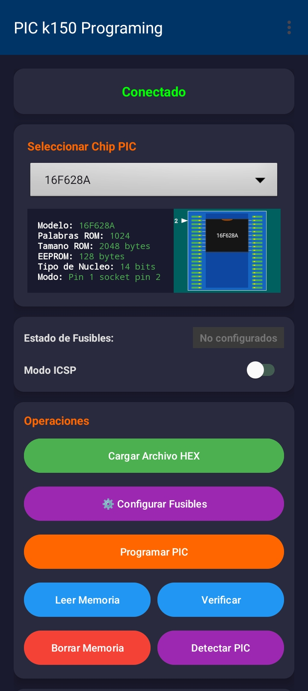
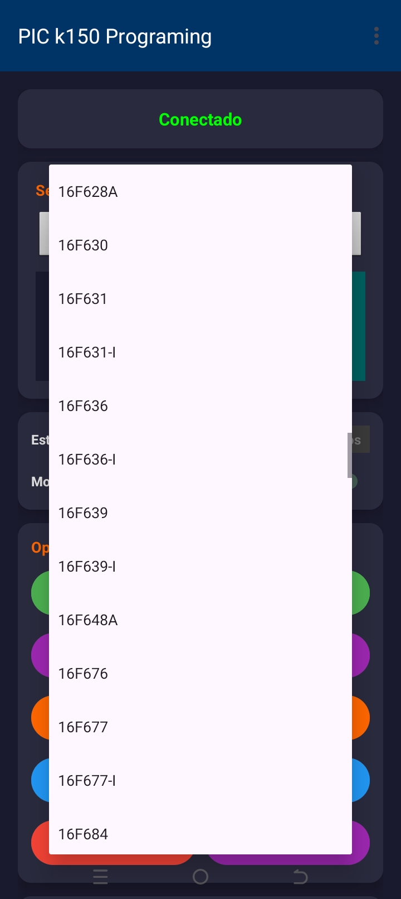
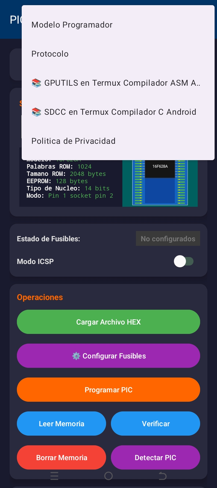
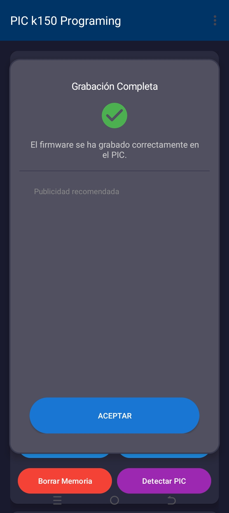
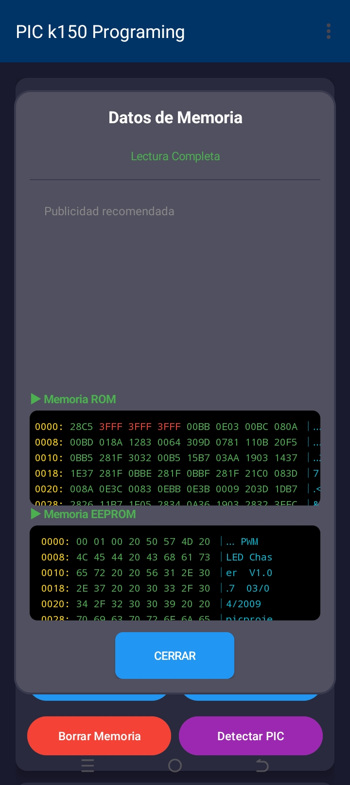
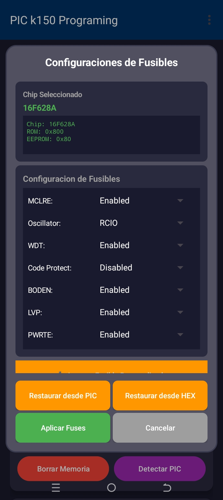
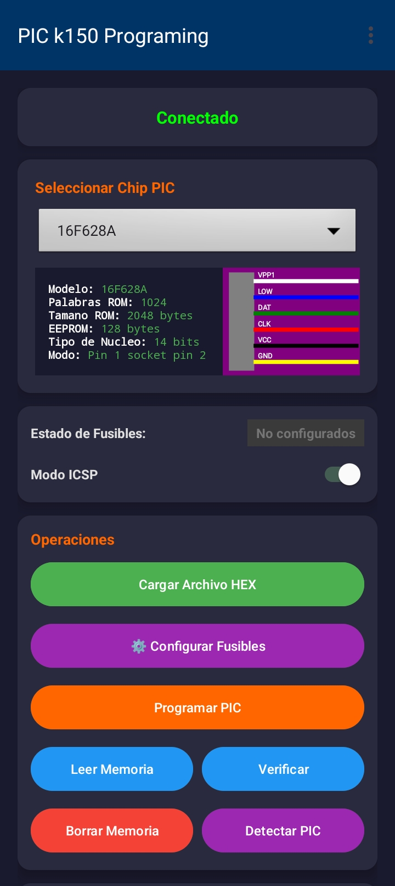

<div align="center">

# PIC k150 Programming

### Programa microcontroladores PIC desde tu dispositivo Android

[](https://play.google.com/store/apps/details?id=com.diamon.pic)


---

</div>

## 📋 Descripción

**PIC k150 Programming** es una aplicación Android profesional que permite programar microcontroladores PIC utilizando el programador PIC k150, todo desde la comodidad de tu dispositivo móvil. La aplicación implementa el **Protocolo P018** de **KITSRUS Programmer Firmware Protocol**, versión de agosto de 2004, garantizando compatibilidad con todos los dispositivos que soportan este estándar industrial.

Esta solución innovadora elimina la necesidad de un equipo de escritorio, permitiendo a desarrolladores embebidos, entusiastas de la electrónica y profesionales programar sus microcontroladores PIC en cualquier lugar usando únicamente su dispositivo Android y un cable USB OTG.

## ✨ Características principales

- **🚀 Programación móvil sin PC**: Programa microcontroladores PIC directamente desde tu teléfono o tablet Android usando el programador PIC k150 o cualquier dispositivo compatible con el protocolo P018
- **📡 Protocolo P018**: Basado en el protocolo estándar KITSRUS Programmer Firmware Protocol P018, garantizando amplia compatibilidad con hardware de programación
- **🔌 Comunicación USB-Serial**: Utiliza la librería de código abierto `usb-serial-for-android` para establecer comunicación USB confiable entre el dispositivo Android y el programador
- **🎯 Interfaz intuitiva**: Diseño Material Design con flujo de trabajo optimizado para cargar archivos HEX y programar con mínimos pasos
- **📊 Soporte multiarquitectura**: Compatible con todas las arquitecturas Android modernas
- **💾 Compatible con archivos HEX**: Soporta formato Intel HEX estándar para carga de firmware
- **📱 OTG Ready**: Funciona con cualquier dispositivo Android que soporte USB Host Mode

## 🏗️ Arquitectura y compatibilidad

### Arquitecturas de procesador soportadas

| Arquitectura | Soportada | Notas |
|--------------|-----------|-------|
| **armeabi-v7a** | ✅ | ARM 32-bit (común en dispositivos antiguos) |
| **arm64-v8a** | ✅ | ARM 64-bit (estándar en dispositivos modernos) |
| **x86** | ✅ | Intel 32-bit (emuladores y tablets Intel) |
| **x86_64** | ✅ | Intel 64-bit (dispositivos Intel modernos) |

### Requisitos del sistema

- **API mínima**: Android 6.0 (Marshmallow) - API Level 23
- **API objetivo**: Android 15 - API Level 36
- **Permisos requeridos**: USB Host Mode
- **Hardware**: Cable USB OTG y programador PIC k150 o compatible

## 🔧 Dispositivos compatibles

La aplicación es compatible con todos los dispositivos que implementan el **Protocolo P018** de **KITSRUS**, incluyendo:

- ✅ **Programador PIC k150** (Verificado y probado)
- ✅ **Programador PIC k128**
- ✅ **Programador PIC k149** (versiones A-F)
- ✅ **Programador PIC k182**
- ✅ **Cualquier dispositivo compatible con protocolo P018**

Este protocolo es ampliamente utilizado en la industria para programación de microcontroladores PIC, asegurando flexibilidad y compatibilidad con diversos fabricantes de hardware.

## 📦 Dependencias y librerías

El proyecto se basa en las siguientes tecnologías y recursos de código abierto:

### Librerías principales

#### usb-serial-for-android
- **Función**: Comunicación serial USB entre Android y hardware externo
- **Licencia**: MIT License
- **Autor**: Mike Wakerly (Google Inc.)
- **Repositorio**: [mik3y/usb-serial-for-android](https://github.com/mik3y/usb-serial-for-android)
- **Descripción**: Librería driver para comunicación con dispositivos seriales USB en Android, usando USB Host Mode disponible desde Android 3.1+

#### picprogrammer
- **Función**: Implementación de lógica de programación basada en protocolo P018
- **Repositorio**: [almost/picprogrammer](https://github.com/almost/picprogrammer)
- **Descripción**: Proyecto original que implementa el protocolo de programación KITSRUS P018

#### picpro
- **Función**: Implementación de múltiples versiones del protocolo KITSRUS
- **Licencia**: LGPL-3.0
- **Autor**: Adam Schubert (Salamek)
- **Repositorio**: [Salamek/picpro](https://github.com/Salamek/picpro)
- **Descripción**: Reescritura completa en Python 3 del programador KITSRUS con mejoras y correcciones

### Herramientas de desarrollo

#### Android Code Studio
- **Función**: IDE de desarrollo Android nativo para dispositivos móviles
- **Repositorio**: [AndroidCSOfficial/android-code-studio](https://github.com/AndroidCSOfficial/android-code-studio)
- **Descripción**: Plataforma potente para desarrollar aplicaciones Android directamente desde un dispositivo Android

#### AndroidIDE (versiones anteriores)
- **Función**: IDE móvil utilizado en versiones anteriores del proyecto
- **Sitio web**: [androidide.com](https://m.androidide.com/)
- **Repositorio**: [AndroidIDEOfficial/AndroidIDE](https://github.com/AndroidIDEOfficial/AndroidIDE)
- **Descripción**: IDE completo para desarrollo Android en dispositivos móviles

### Servicios integrados

- **Firebase Crashlytics**: Reporte y análisis de errores en tiempo real
- **Firebase Analytics**: Análisis de uso y comportamiento de usuarios
- **Google AdMob**: Monetización mediante publicidad
- **Microsoft App Center**: Analytics y crash reporting adicional

## 🔗 Enlaces útiles

- 🌐 **KITSRUS - Página oficial**: [kitsrus.com](https://www.kitsrus.com)
- 📚 **Documentación Protocolo P018**: [KITSRUS Programmer Protocols](https://www.kitsrus.com/pic.html)
- 📱 **Aplicación en Google Play**: 

  <a href="https://play.google.com/store/apps/details?id=com.diamon.pic">
    
  </a>

## 🚀 Instrucciones de instalación

### Para usuarios

1. **Descarga desde Google Play Store**:
   - Visita [Google Play Store](https://play.google.com/store/apps/details?id=com.diamon.pic)
   - Instala la aplicación en tu dispositivo Android

2. **Configura el hardware**:
   - Conecta el programador PIC k150 a tu dispositivo Android mediante un cable USB OTG
   - La aplicación solicitará permisos USB automáticamente

3. **Comienza a programar**:
   - Abre la aplicación
   - Selecciona tu archivo HEX
   - Conecta el microcontrolador PIC al programador
   - Presiona el botón de programación

### Para desarrolladores

1. **Clona el repositorio**:
   ```bash
   git clone https://github.com/Danielk10/PIC-k150-Programing.git
   cd PIC-k150-Programing
   ```

2. **Abre el proyecto**:
   - Usa Android Studio o Android Code Studio
   - Abre el proyecto clonado
   - Espera a que Gradle sincronice las dependencias

3. **Configura el entorno**:
   - **JDK**: Java 11
   - **NDK**: 29.0.13599879 rc2
   - **Build Tools**: 36.0.0
   - **Compile SDK**: 36

4. **Compila y prueba**:
   ```bash
   ./gradlew assembleDebug
   ```

5. **Instala en dispositivo**:
   - Conecta tu dispositivo Android con depuración USB habilitada
   - Ejecuta desde Android Studio o:
   ```bash
   ./gradlew installDebug
   ```

6. **Prueba la aplicación**:
   - Conecta el programador PIC k150 mediante USB OTG
   - Carga un archivo HEX de prueba
   - Verifica la comunicación con el programador

## 👨‍💻 Autores y agradecimientos

### Desarrollador principal

**Danielk10**
- Desarrollador y mantenedor principal del proyecto
- Implementación de la interfaz Android y lógica de programación
- Integración del protocolo P018 con Android

### Agradecimientos especiales

- **Mike Wakerly y Google Inc.** - Por la excelente librería `usb-serial-for-android` que hace posible la comunicación USB
- **Colaboradores de picprogrammer** - Por la implementación de referencia del protocolo P018
- **Adam Schubert (Salamek)** - Por el proyecto `picpro` y la documentación del protocolo KITSRUS
- **Equipo de AndroidIDE** - Por proporcionar las herramientas de desarrollo móvil
- **Equipo de Android Code Studio** - Por el IDE de desarrollo actual
- **KITSRUS** - Por el desarrollo y documentación del protocolo P018 que permite la interoperabilidad estándar

## 🤝 Contribuciones

Las contribuciones son bienvenidas y apreciadas. Si deseas mejorar la aplicación o agregar nuevas características:

1. **Fork** el proyecto
2. Crea una **rama** para tu característica (`git checkout -b feature/AmazingFeature`)
3. **Commit** tus cambios (`git commit -m 'Add some AmazingFeature'`)
4. **Push** a la rama (`git push origin feature/AmazingFeature`)
5. Abre un **Pull Request**

### Guías de contribución

- Sigue las mejores prácticas de codificación Java/Android
- Realiza pruebas exhaustivas antes de enviar
- Documenta nuevas funcionalidades
- Mantén compatibilidad con API 23+
- Respeta la arquitectura del proyecto

## 📄 Licencia

Este proyecto está licenciado bajo la **GNU General Public License v3.0 (GPL-3.0)**.

### Resumen de la licencia

- ✅ **Uso comercial permitido**
- ✅ **Modificación permitida**
- ✅ **Distribución permitida**
- ✅ **Uso privado permitido**
- ⚠️ **Obligatorio**: Revelar código fuente de modificaciones
- ⚠️ **Obligatorio**: Mantener misma licencia en derivados
- ⚠️ **Obligatorio**: Incluir aviso de copyright y licencia

Para más detalles, consulta el archivo [LICENSE.txt](LICENSE.txt).

### Licencias de dependencias

| Proyecto | Licencia | Autor |
|----------|----------|---------|
| usb-serial-for-android | MIT | Google Inc. / Mike Wakerly |
| picpro | LGPL-3.0 | Adam Schubert (Salamek) |
| picprogrammer | Varies | Proyecto comunitario |

## 🛠️ Especificaciones técnicas

### Tecnologías utilizadas

- **Lenguaje**: Java 11
- **Framework**: Android SDK
- **Build System**: Gradle 8.x
- **UI Framework**: Material Design Components
- **Comunicación**: USB Host API + usb-serial-for-android
- **Crash Reporting**: Firebase Crashlytics + App Center
- **Analytics**: Firebase Analytics + App Center Analytics

### Estructura del proyecto

```
PIC-k150-Programing/
├── app/
│   ├── src/
│   │   ├── main/
│   │   │   ├── java/com/diamon/pic/
│   │   │   ├── res/
│   │   │   └── AndroidManifest.xml
│   │   └── test/
│   └── build.gradle
├── gradle/
├── build.gradle
├── settings.gradle
├── LICENSE.txt
└── README.md
```

## 📱 Capturas de pantalla

<div align="center">

<table>
  <tr>
    <td align="center">
      
      <br>
      <em>Pantalla principal</em>
    </td>
    <td align="center">
      
      <br>
      <em>Selección de dispositivos</em>
    </td>
  </tr>
  <tr>
    <td align="center">
      
      <br>
      <em>Menú</em>
    </td>
    <td align="center">
      
      <br>
      <em>Proceso de programación</em>
    </td>
  </tr>
  <tr>
    <td align="center">
      
      <br>
      <em>Configuración</em>
    </td>
    <td align="center">
      
      <br>
      <em>Opciones avanzadas</em>
    </td>
  </tr>
  <tr>
    <td align="center" colspan="2">
      
      <br>
      <em>ICSP</em>
    </td>
  </tr>
</table>

</div>

## 🔮 Roadmap

- [ ] Soporte para más familias de microcontroladores PIC
- [ ] Modo batch para programación múltiple
- [ ] Interfaz de configuración de fuses avanzada
- [ ] Soporte para programadores adicionales
- [ ] Modo offline con caché de configuraciones
- [ ] Temas oscuro/claro personalizables

## 📞 Soporte y contacto

Si encuentras algún problema o tienes sugerencias:

- 🐛 **Reportar bugs**: [GitHub Issues](https://github.com/Danielk10/PIC-k150-Programing/issues)
- 💡 **Sugerencias**: [GitHub Discussions](https://github.com/Danielk10/PIC-k150-Programing/discussions)
- 📧 **Email**: [Contacto mediante Google Play](https://play.google.com/store/apps/details?id=com.diamon.pic)

---

<div align="center">

**Hecho con ❤️ por Danielk10**

**Powered by Android · KITSRUS Protocol P018 · Open Source**

[](https://github.com/Danielk10/PIC-k150-Programing)
[](https://github.com/Danielk10/PIC-k150-Programing/fork)

</div>