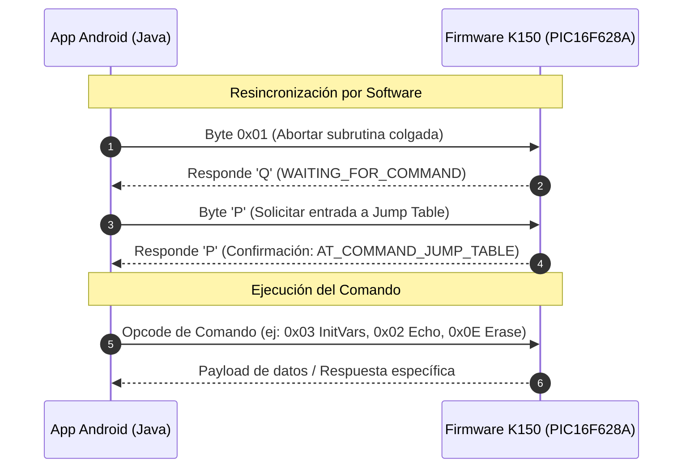

# Arquitectura de Sincronización del Protocolo K150 en Android (USB-OTG vs PC)

Este documento detalla la solución de ingeniería implementada en **PIC-k150-Programing** para resolver el problema crítico de sincronización y conexión con los programadores PIC K150 (y compatibles K128/K149) a través de USB-OTG en Android.

---

## 1. El Problema: Ciclo de Vida y Física del Hardware

El programador K150 utiliza como cerebro interno un microcontrolador **PIC16F628A** que ejecuta el firmware del protocolo Kitsrus (**P18A / P018**), comunicado a través de un puente USB-UART (típicamente Prolific PL-2303, CH340 o FTDI).

Según la especificación técnica original ([`softprotocol5.txt`](file:///home/danielpdiamon/PIC-k150-Programing/app/src/main/assets/softprotocol5.txt)), el flujo de vida del programador se divide en tres fases:

```
[ FASE 1: POWER-UP ]
  El microcontrolador K150 arranca o se resetea por hardware.
  Emite UNA SOLA VEZ por UART: 'B' + Firmware_Type (ej. 'B' y 0x03 para K150).
          │
          ▼
[ FASE 2: WAIT FOR COMMAND START ]
  El firmware se queda en un bucle esperando el inicio de comando.
  - Si recibe 0x01: Responde 'Q' (WAITING_FOR_COMMAND).
  - Si recibe 'P':  Responde 'P' y entra a la tabla de salto.
          │
          ▼
[ FASE 3: COMMAND JUMP TABLE ]
  El firmware espera el número de comando a ejecutar (3=InitVars, 14=Erase, etc.).
```

---

## 2. ¿Por qué `picpro` en PC Linux puede usar la Fase 1 (Power-up)?

En entornos de escritorio (Linux / Windows), herramientas como **`picpro`** implementan el handshake inicial mediante un **reseteo por hardware vía DTR**:

```python
# picpro/protocol/IConnection.py
def reset(self):
    self.serial_connection.dtr = True   # Fuerza la línea DTR
    time.sleep(.1)
    self.serial_connection.dtr = False  # Libera DTR
    response = self.read(2)             # Lee 'B' + 0x03
```

* **Mecanismo:** En la placa del K150, la línea DTR del chip USB-UART está físicamente conectada al pin **MCLR** del PIC16F628A.
* **Resultado:** Al conmutar DTR con llamadas `ioctl` del kernel Linux, el PIC16F628A sufre un reinicio eléctrico real (Hardware Reset), ejecutando su vector de arranque y volviendo a transmitir `'B'` y `0x03`.

---

## 3. La Falla Inevitable de ese Enfoque en Android USB-OTG

Intentar replicar el flujo de `picpro` en Android con USB-OTG genera fallos de conexión permanentes debido a dos factores críticos:

### A. Desfase Temporal de Alimentación (VBUS OTG)
1. Al enchufar el adaptador USB-OTG al teléfono, el sistema operativo Android entrega inmediatamente 5V por el pin VBUS.
2. En ese milisegundo exacto, el K150 se enciende, transmite `'B\x03'` y pasa a la Fase 2 (*WAIT FOR COMMAND START*).
3. En ese instante, **la aplicación Android ni siquiera está abierta**, o el sistema operativo está mostrando el modal de seguridad:
   > *"¿Desea permitir que PIC-k150-Programing acceda al dispositivo USB?"*
4. Para cuando el usuario pulsa "Aceptar" y la aplicación abre el puerto serie (`usbSerialPort.open()`), el paquete de Power-up `'B\x03'` **se perdió hace varios segundos**. Si la app espera ese paquete, cae en un **Timeout infinito**.

### B. Ineficacia del Reset DTR por Software en Espacio de Usuario
* En Android (sin root), el acceso USB se realiza en espacio de usuario mediante la API `android.hardware.usb` (`UsbRequest` / `controlTransfer`).
* En los clones habituales de bajo costo del K150 (chips PL-2303HX o CH340), los comandos de control USB para alterar DTR frecuentemente no generan una caída de voltaje suficiente o con la duración adecuada para disparar el reset físico en el pin MCLR.
* Sin reset físico, **el firmware del K150 nunca volverá a emitir `'B\x03'`**.

---

## 4. La Solución: Resincronización Universal por Software

Para superar estas limitaciones, **`PIC-k150-Programing`** descarta la dependencia del Power-up y del reset eléctrico, implementando una **resincronización de software determinista** antes de cada comando directamente desde la **Command Jump Table** ([`Protocolo.java#L240-L260`](file:///home/danielpdiamon/PIC-k150-Programing/app/src/main/java/com/diamon/nucleo/Protocolo.java#L240-L260)):



### Pasos del Algoritmo en `Protocolo.java`:

1. **Paso 1 - Forzar salida de cualquier estado (`0x01`):**
   * Se envía `0x01`. Si el K150 estaba a la mitad de una transferencia interrumpida o esperando datos, el byte `0x01` lo devuelve de forma segura al estado base.
   * Se valida la respuesta `'Q'` (`expectResponse({'Q'})`).
2. **Paso 2 - Acceso a la Tabla de Salto (`'P'`):**
   * Se envía el carácter `'P'`.
   * El firmware del K150 responde con un eco `'P'`, confirmando que está posicionado en el monitor de comandos.
3. **Paso 3 - Despacho del Opcode:**
   * Se transmite el identificador numérico de la operación solicitada (Eco, Inicializar Variables, Detección, Lectura, Escritura o Borrado).

---

## 5. Tabla Comparativa de Enfoques

| Dimensión | `picpro` (PC Linux) | `PIC-k150-Programing` (Android) |
| :--- | :--- | :--- |
| **Punto de Entrada** | Fase 1 (Power-up / Reset físico) | **Fase 3 (Command Jump Table con resync)** |
| **Dependencia de DTR** | Crítica (requiere ioctls del kernel) | **Nula** (opera 100% por flujo de datos serie) |
| **Tolerancia a reconexiones** | Débil si el buffer de entrada queda sucio | **Alta** (limpia buffer y reengancha con `0x01 -> 'Q'`) |
| **Compatibilidad con adaptadores OTG** | N/A (solo PC) | **Universal** (funciona en cualquier Android 5.0+) |
| **Soporte de chips clones** | Falla en clones con DTR flotante | **100% compatible** con PL2303, CH340, CP2102 y FTDI |

---

## 6. Conclusión Técnica

La decisión de omitir la espera del Power-up (`'B\x03'`) y entrar directamente a la **Command Jump Table** mediante la secuencia `0x01 -> 'Q' -> 'P' -> 'P'` fue el avance clave que permitió el funcionamiento confiable de **PIC-k150-Programing** en Android. 

Convierte un protocolo originalmente diseñado para puertos COM de PC de los años 90 en una máquina de estados tolerante a desconexiones en caliente, ruido y limitaciones propias del subsistema USB-OTG móvil.
